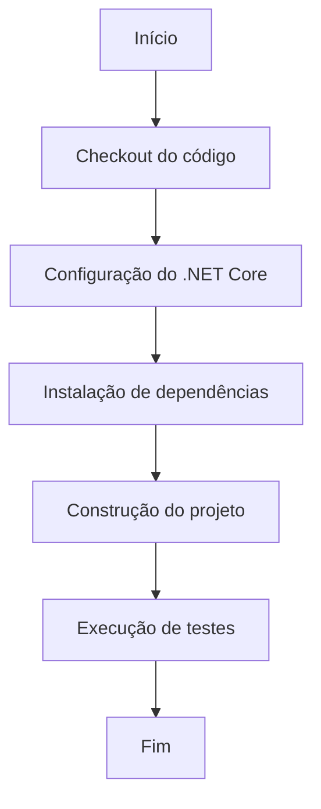

# dotnet-core.yml: Fluxo de Trabalho do GitHub para .NET Core

## Visão Geral
Este documento descreve o fluxo de trabalho do GitHub para a construção, teste e restauração de um projeto .NET Core. O fluxo de trabalho é acionado por eventos de push e pull request na branch master.

## Fluxo de Processo


## Insights
- O fluxo de trabalho é acionado por eventos de push e pull request na branch master.
- O fluxo de trabalho é executado em um ambiente Ubuntu.
- O fluxo de trabalho utiliza a versão 6.0.x do .NET Core.
- O fluxo de trabalho realiza as seguintes ações:
  - Checkout do código
  - Configuração do .NET Core
  - Instalação de dependências
  - Construção do projeto
  - Execução de testes

## Dependências
```mermaid
graph LR
    dotnet-core.yml --- |"Usa"| actions/checkout@v2
    dotnet-core.yml --- |"Usa"| actions/setup-dotnet@v1
```
- `actions/checkout@v2` : Realiza o checkout do código do repositório.
- `actions/setup-dotnet@v1` : Configura o ambiente com a versão especificada do .NET Core.

## Vulnerabilidades
- O fluxo de trabalho é executado em qualquer push ou pull request na branch master, o que pode levar a execução de código malicioso se a segurança do repositório for comprometida.
- O fluxo de trabalho depende de ações externas (`actions/checkout@v2` e `actions/setup-dotnet@v1`), que podem ter suas próprias vulnerabilidades ou podem ser comprometidas.