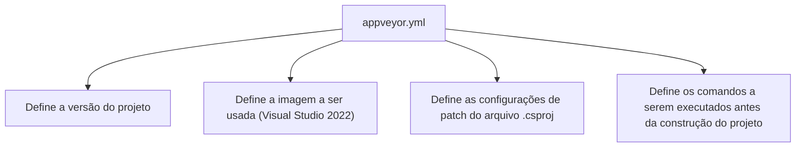

# appveyor.yml: Configuração do AppVeyor para um Projeto .NET

## Visão Geral

Este arquivo de configuração `appveyor.yml` é usado para definir as configurações do AppVeyor para um projeto .NET. Ele especifica a versão do projeto, a imagem a ser usada (Visual Studio 2022), as configurações de patch do arquivo `.csproj`, e os comandos a serem executados antes da construção do projeto.

## Fluxo do Processo

## Insights

- A versão do projeto é definida como `1.0.{build}`.
- A imagem usada para a construção do projeto é o Visual Studio 2022.
- As configurações de patch do arquivo `.csproj` são definidas para atualizar várias propriedades de versão com o valor `{version}`.
- Antes da construção do projeto, os comandos `dotnet restore` e `dotnet build` são executados.
- A verbosidade da construção é definida como mínima.

## Dependências (Opcional)

Este arquivo de configuração não parece ter dependências externas diretas, além das ferramentas e ambientes mencionados (como o .NET e o Visual Studio 2022).