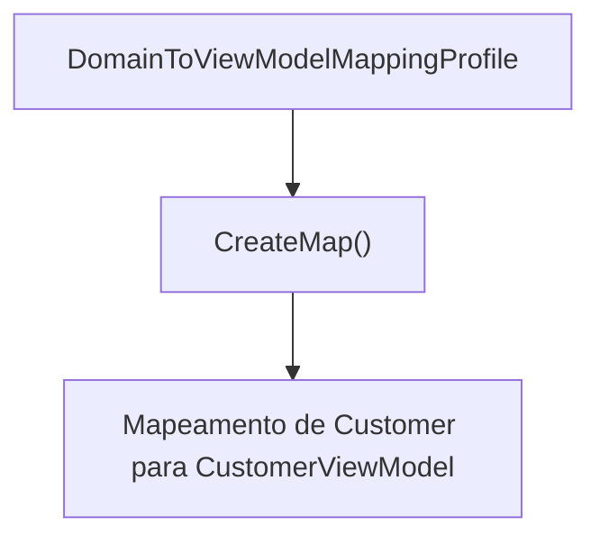
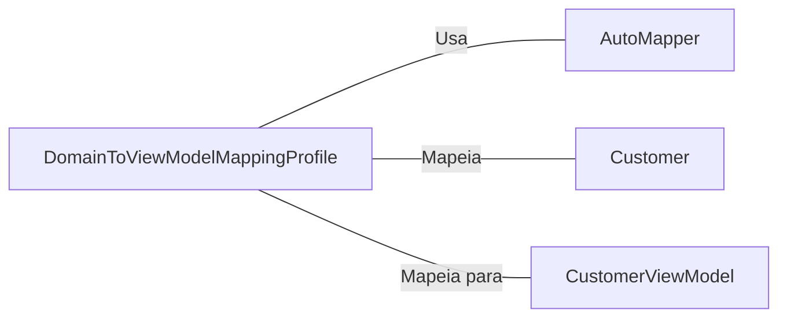

# DomainToViewModelMappingProfile.cs: Mapeamento de Domínio para ViewModel

## Visão Geral
Este arquivo define uma classe `DomainToViewModelMappingProfile` que herda da classe `Profile` do AutoMapper. A principal responsabilidade desta classe é configurar o mapeamento de um objeto de domínio `Customer` para um objeto de visualização `CustomerViewModel`.

## Fluxo do Processo

Este diagrama de fluxo de processo mostra que a classe `DomainToViewModelMappingProfile` cria um mapeamento de `Customer` para `CustomerViewModel` usando o método `CreateMap`.

## Insights
- A classe `DomainToViewModelMappingProfile` é usada para configurar o mapeamento de objetos de domínio para objetos de visualização.
- O método `CreateMap` do AutoMapper é usado para definir o mapeamento de `Customer` para `CustomerViewModel`.

## Dependências (Opcional)
A classe `DomainToViewModelMappingProfile` tem as seguintes dependências externas:

- `AutoMapper`: Usado para configurar o mapeamento de objetos.
- `Customer`: O objeto de domínio que é mapeado.
- `CustomerViewModel`: O objeto de visualização para o qual o objeto de domínio é mapeado.

## Vulnerabilidades
Não foram identificadas vulnerabilidades específicas neste código. No entanto, é importante garantir que os objetos de domínio e de visualização estejam corretamente definidos e que o mapeamento esteja funcionando como esperado para evitar problemas de manipulação de dados.