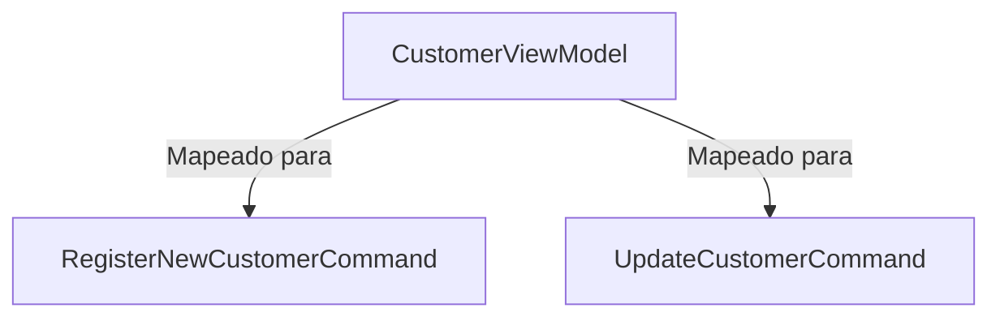
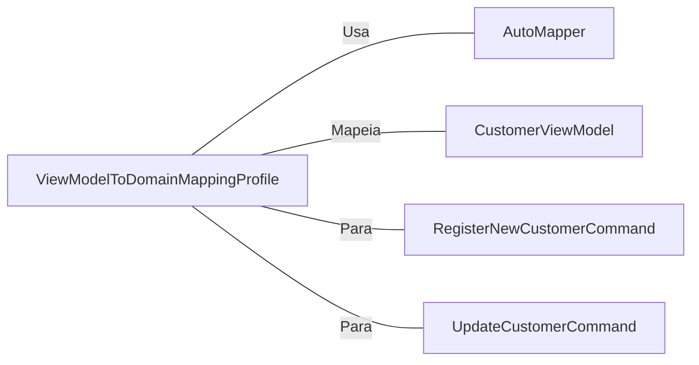

# ViewModelToDomainMappingProfile.cs: Mapeamento de ViewModel para Comandos de Domínio

## Visão Geral
Este arquivo contém a classe `ViewModelToDomainMappingProfile` que é responsável por mapear os dados de um `CustomerViewModel` para os comandos de domínio `RegisterNewCustomerCommand` e `UpdateCustomerCommand`.

## Fluxo do Processo

## Insights
- A classe `ViewModelToDomainMappingProfile` herda de `Profile`, que é uma classe do AutoMapper.
- O AutoMapper é usado para mapear os dados de um `CustomerViewModel` para os comandos de domínio `RegisterNewCustomerCommand` e `UpdateCustomerCommand`.
- O método `CreateMap` do AutoMapper é usado para definir o mapeamento.

## Dependências (Opcional)

- `AutoMapper`: Biblioteca usada para mapear objetos de um tipo para outro.
- `CustomerViewModel`: Modelo de visualização que contém os dados do cliente que serão mapeados para os comandos de domínio.
- `RegisterNewCustomerCommand`: Comando de domínio para registrar um novo cliente.
- `UpdateCustomerCommand`: Comando de domínio para atualizar um cliente existente.

## Vulnerabilidades
Não foram identificadas vulnerabilidades no código.