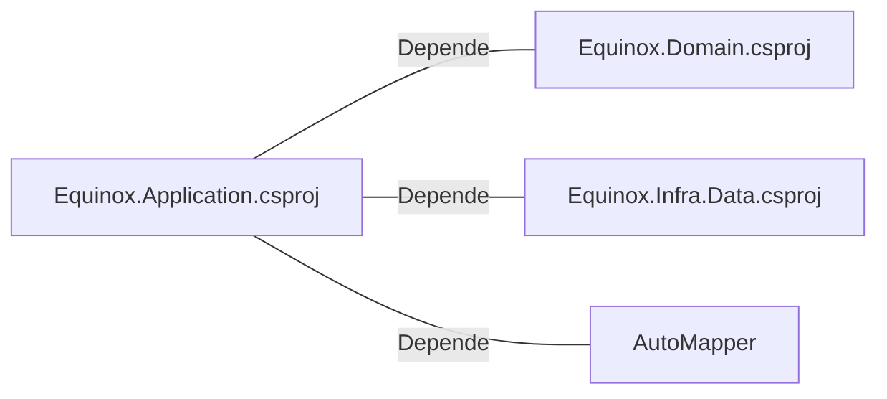

# Equinox.Application.csproj: Projeto de Aplicação Equinox

## Visão Geral
Este é um arquivo de projeto C# (.csproj) para a aplicação Equinox. Ele define o framework de destino como .NET 6.0 e inclui referências a outros projetos e pacotes necessários para a aplicação.

## Fluxo de Processo
Como este é um arquivo de projeto e não contém lógica de programação, um diagrama de fluxo de processo não é aplicável. No entanto, as dependências do projeto podem ser representadas em um diagrama de classes ou em uma tabela.

## Insights
- O projeto é construído usando o .NET 6.0, conforme especificado na tag `<TargetFramework>`.
- O projeto tem dependências em outros dois projetos: `Equinox.Domain` e `Equinox.Infra.Data`.
- O projeto também tem uma dependência no pacote `AutoMapper`.

## Dependências
O projeto tem dependências em outros dois projetos e um pacote NuGet. Essas dependências são representadas no diagrama a seguir:

- `Equinox.Domain.csproj` : O projeto Equinox.Application.csproj depende do projeto Equinox.Domain.csproj.
- `Equinox.Infra.Data.csproj` : O projeto Equinox.Application.csproj depende do projeto Equinox.Infra.Data.csproj.
- `AutoMapper` : O projeto Equinox.Application.csproj depende do pacote NuGet AutoMapper.

## Vulnerabilidades
Como este é um arquivo de projeto e não contém lógica de programação, não há vulnerabilidades de código a serem destacadas. No entanto, é importante garantir que todas as dependências do projeto, como o AutoMapper, estejam atualizadas para evitar possíveis vulnerabilidades de segurança conhecidas nessas bibliotecas.