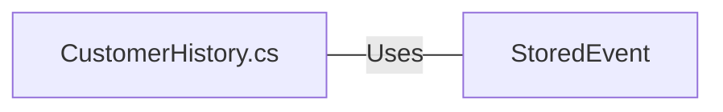

# CustomerHistory.cs: Normalizador de Histórico de Clientes

## Visão Geral
O arquivo `CustomerHistory.cs` é responsável por normalizar o histórico de eventos relacionados a um cliente. Ele recebe uma lista de eventos armazenados, deserializa os dados do evento, classifica os eventos por data e hora e retorna uma lista de dados de histórico de cliente.

## Fluxo do Processo

```mermaid
graph TD
    A[ToJavaScriptCustomerHistory] --> B[CustomerHistoryDeserializer]
    B --> C{MessageType}
    C --> |"CustomerRegisteredEvent"| D[Action = "Registered"]
    C --> |"CustomerUpdatedEvent"| E[Action = "Updated"]
    C --> |"CustomerRemovedEvent"| F[Action = "Removed"]
    C --> |"Default"| G[Action = "Unrecognized"]
    D --> H[HistoryData.Add]
    E --> H
    F --> H
    G --> H
    H --> I[Return list]
```

## Insights
- A classe `CustomerHistory` é uma classe estática, o que significa que ela não pode ser instanciada ou herdada.
- A classe `CustomerHistory` possui um método `ToJavaScriptCustomerHistory` que recebe uma lista de eventos armazenados e retorna uma lista de dados de histórico de cliente.
- O método `ToJavaScriptCustomerHistory` utiliza o método `CustomerHistoryDeserializer` para deserializar os dados do evento.
- O método `CustomerHistoryDeserializer` verifica o tipo de mensagem do evento e atribui uma ação correspondente.
- Se o tipo de mensagem do evento não for reconhecido, a ação é definida como "Unrecognized" e o usuário é definido como "Anonymous" se não houver usuário.

## Dependências (Opcional)
- `StoredEvent`: Classe que representa um evento armazenado. É usada para deserializar os dados do evento.



- `StoredEvent` : Classe que representa um evento armazenado. É usada para deserializar os dados do evento.

## Vulnerabilidades
- O método `CustomerHistoryDeserializer` não possui tratamento de exceções para erros de deserialização. Se os dados do evento não estiverem no formato correto, o método `JsonSerializer.Deserialize<CustomerHistoryData>` lançará uma exceção.
- O método `CustomerHistoryDeserializer` assume que o campo `Timestamp` sempre estará no formato correto. Se o campo `Timestamp` não estiver no formato correto, o método `DateTime.Parse` lançará uma exceção.
- O método `ToJavaScriptCustomerHistory` não verifica se a lista de eventos armazenados é nula antes de chamar o método `CustomerHistoryDeserializer`. Se a lista de eventos armazenados for nula, uma exceção `NullReferenceException` será lançada.