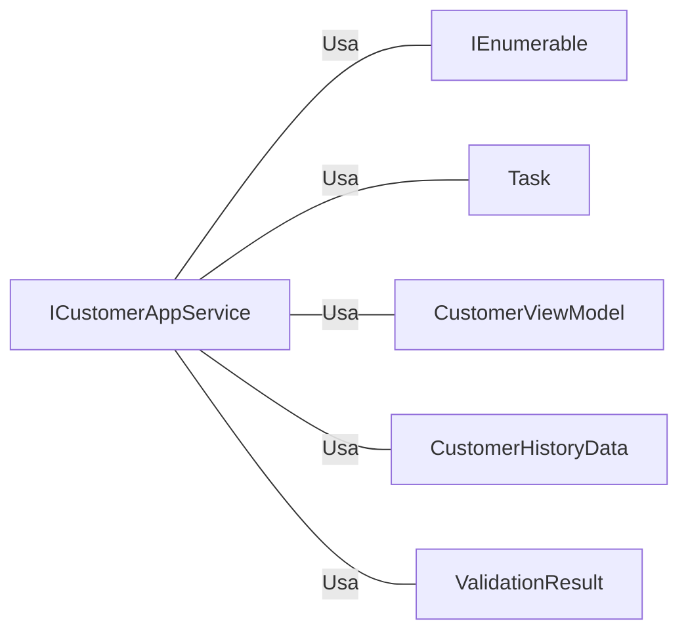

# ICustomerAppService.cs: Interface de Serviço de Aplicação do Cliente

## Visão Geral
Este arquivo define a interface `ICustomerAppService`, que é responsável por fornecer métodos para operações CRUD (Create, Read, Update, Delete) e histórico de clientes.

## Fluxo do Processo
Como este arquivo é uma estrutura de dados (interface), não há um fluxo de processo específico. No entanto, a estrutura da interface `ICustomerAppService` pode ser representada como uma tabela:

| Método | Descrição |
| ------ | --------- |
| `GetAll()` | Retorna todos os clientes |
| `GetById(Guid id)` | Retorna um cliente específico pelo ID |
| `Register(CustomerViewModel customerViewModel)` | Registra um novo cliente |
| `Update(CustomerViewModel customerViewModel)` | Atualiza um cliente existente |
| `Remove(Guid id)` | Remove um cliente específico pelo ID |
| `GetAllHistory(Guid id)` | Retorna todo o histórico de um cliente específico pelo ID |

## Insights
- A interface `ICustomerAppService` herda de `IDisposable`, o que sugere que os objetos que implementam esta interface podem liberar recursos não gerenciados.
- A interface `ICustomerAppService` define métodos para operações CRUD em `CustomerViewModel`.
- A interface `ICustomerAppService` também define um método para obter o histórico de um cliente.
- Todos os métodos são assíncronos, o que sugere que eles são projetados para operações não bloqueantes.

## Dependências (Opcional)
A interface `ICustomerAppService` depende das seguintes classes e interfaces:

- `System.Collections.Generic.IEnumerable<T>`
- `System.Threading.Tasks.Task<T>`
- `Equinox.Application.ViewModels.CustomerViewModel`
- `Equinox.Application.EventSourcedNormalizers.CustomerHistoryData`
- `FluentValidation.Results.ValidationResult`

Diagrama de dependências:

Lista de dependências:

- `IEnumerable<T>` : Usado para retornar uma lista de `CustomerViewModel` no método `GetAll()`.
- `Task<T>` : Usado para tornar os métodos assíncronos.
- `CustomerViewModel` : Usado como parâmetro nos métodos `Register()` e `Update()`.
- `CustomerHistoryData` : Usado para retornar uma lista de histórico de cliente no método `GetAllHistory()`.
- `ValidationResult` : Usado como tipo de retorno nos métodos `Register()`, `Update()` e `Remove()` para fornecer resultados de validação.

## Vulnerabilidades
Como este é um arquivo de interface, não há implementações de código específicas para analisar em busca de vulnerabilidades. No entanto, é importante notar que qualquer classe que implemente esta interface deve garantir que os dados sejam validados e sanitizados corretamente para evitar vulnerabilidades de segurança, como injeção de SQL ou ataques de script entre sites (XSS). Além disso, a manipulação adequada de erros e exceções deve ser implementada para evitar a divulgação de informações sensíveis.