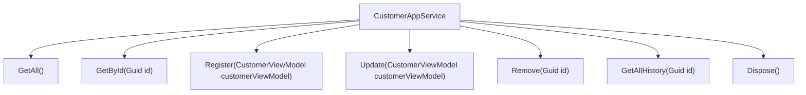
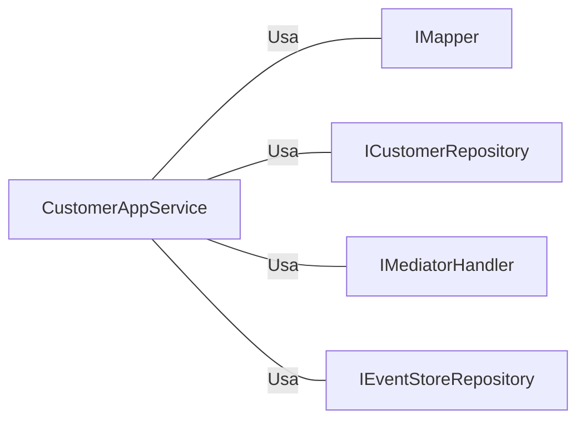

# CustomerAppService.cs: Serviço de Aplicação do Cliente

## Visão Geral
Este código é uma classe de serviço de aplicação para a entidade Cliente. Ele fornece métodos para operações CRUD (Create, Read, Update, Delete) e histórico de clientes. A classe `CustomerAppService` implementa a interface `ICustomerAppService` e depende de `IMapper`, `ICustomerRepository`, `IMediatorHandler` e `IEventStoreRepository`.

## Fluxo do Processo

## Insights
- A classe `CustomerAppService` implementa a interface `ICustomerAppService`.
- A classe `CustomerAppService` depende de `IMapper`, `ICustomerRepository`, `IMediatorHandler` e `IEventStoreRepository`.
- A classe `CustomerAppService` fornece métodos para operações CRUD (Create, Read, Update, Delete) e histórico de clientes.
- O método `Dispose()` é usado para liberar recursos não gerenciados.

## Dependências
A classe `CustomerAppService` tem as seguintes dependências externas:

- `IMapper` : Usado para mapear entre objetos de domínio e objetos de visualização.
- `ICustomerRepository` : Usado para realizar operações de banco de dados na entidade Cliente.
- `IMediatorHandler` : Usado para enviar comandos para o manipulador de comandos.
- `IEventStoreRepository` : Usado para obter o histórico de eventos do cliente.

## Vulnerabilidades
- O código não possui validação de entrada para os métodos, o que pode levar a problemas de segurança, como ataques de injeção.
- O código não possui tratamento de exceções, o que pode levar a falhas inesperadas do programa.
- O código não possui logs, o que pode dificultar a depuração de problemas.