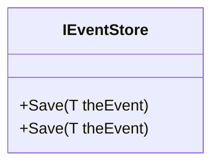

# IEventStore.cs: Interface de Armazenamento de Eventos

## Visão Geral
A interface `IEventStore` é uma estrutura de dados que define um contrato para o armazenamento de eventos. Ela possui um único método `Save` que é responsável por salvar um evento genérico.

## Fluxo do Processo
Como `IEventStore` é uma estrutura de dados (interface), não possui um fluxo de processo. No entanto, ela define um método `Save` que pode ser implementado por qualquer classe que implemente a interface. Abaixo está uma representação do método:

## Insights
- A interface `IEventStore` define um contrato para o armazenamento de eventos.
- O método `Save` é genérico, permitindo que qualquer tipo de evento seja salvo.

## Dependências (Opcional)
A interface `IEventStore` não possui dependências externas.

## Manipulação de Dados (SQL) (Opcional)
A interface `IEventStore` não realiza nenhuma operação de manipulação de dados SQL.

## Vulnerabilidades
Como uma interface, `IEventStore` não possui implementação e, portanto, não apresenta vulnerabilidades inerentes. No entanto, qualquer classe que implemente `IEventStore` deve garantir que a implementação do método `Save` seja segura. Isso pode incluir a validação de entrada, o tratamento de exceções e a garantia de que os dados do evento estão sendo armazenados de maneira segura e eficiente.