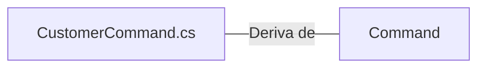

# CustomerCommand.cs: Comandos do Cliente

## Visão Geral
Este arquivo define uma estrutura de dados chamada `CustomerCommand`, que é uma classe abstrata derivada da classe `Command` do pacote `NetDevPack.Messaging`. A classe `CustomerCommand` contém quatro propriedades: `Id`, `Name`, `Email` e `BirthDate`.

## Fluxo do Processo
Como `CustomerCommand` é uma estrutura de dados, não há um fluxo de processo. No entanto, a estrutura dos dados pode ser representada como uma tabela:

| Atributo | Tipo de Dados | Descrição |
|----------|---------------|-----------|
| Id       | Guid          | Identificador único do cliente. |
| Name     | string        | Nome do cliente. |
| Email    | string        | Email do cliente. |
| BirthDate| DateTime      | Data de nascimento do cliente. |

## Insights
- A classe `CustomerCommand` é abstrata, o que significa que não pode ser instanciada diretamente. Ela serve como uma classe base para outras classes de comando de cliente.
- Todas as propriedades da classe `CustomerCommand` são protegidas, o que significa que só podem ser acessadas dentro da própria classe e por classes derivadas.
- A classe `CustomerCommand` é derivada da classe `Command` do pacote `NetDevPack.Messaging`, que provavelmente fornece funcionalidades básicas de comando.

## Dependências (Opcional)
A classe `CustomerCommand` tem uma dependência externa:

- `Command` : Classe base da qual `CustomerCommand` deriva. Faz parte do pacote `NetDevPack.Messaging`.

## Vulnerabilidades
Não foram identificadas vulnerabilidades específicas no código. No entanto, é importante notar que, como a classe `CustomerCommand` é abstrata, ela deve ser usada com cuidado. Classes derivadas devem garantir que os dados sejam validados corretamente antes de serem usados. Além disso, como as propriedades são protegidas, elas só podem ser acessadas dentro da própria classe e por classes derivadas, o que pode limitar a flexibilidade do código.