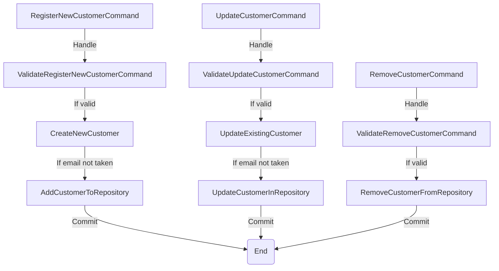
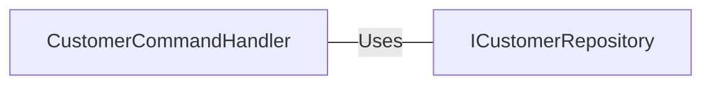

# CustomerCommandHandler.cs: Manipulador de Comandos do Cliente

## Visão Geral
Este código é responsável por manipular os comandos relacionados ao cliente no sistema. Ele implementa três comandos principais: `RegisterNewCustomerCommand`, `UpdateCustomerCommand` e `RemoveCustomerCommand`. Cada comando é tratado por um método específico que valida o comando, realiza a operação correspondente e retorna um `ValidationResult`.

## Fluxo do Processo

## Insights
- O código faz uso intensivo do padrão de design Command Handler para lidar com diferentes comandos relacionados ao cliente.
- O código faz uso do repositório `ICustomerRepository` para realizar operações de banco de dados.
- O código valida cada comando antes de executar a operação correspondente.
- O código verifica se o e-mail do cliente já foi usado antes de registrar ou atualizar um cliente.
- O código adiciona um evento de domínio após cada operação bem-sucedida.

## Dependências (Opcional)
O código tem uma dependência externa no `ICustomerRepository`, que é usado para realizar operações de banco de dados.

- `ICustomerRepository` : Usado para realizar operações de banco de dados. O código chama os métodos `GetByEmail`, `Add`, `Update`, `GetById` e `Remove` deste repositório.

## Vulnerabilidades
- O código não verifica se o cliente existe antes de tentar atualizá-lo ou removê-lo. Isso pode levar a erros se o cliente não existir.
- O código não verifica se o e-mail do cliente é válido antes de tentar registrá-lo ou atualizá-lo. Isso pode levar a erros se o e-mail não for válido.
- O código não verifica se a operação de banco de dados foi bem-sucedida antes de retornar um `ValidationResult`. Isso pode levar a resultados de validação enganosos se a operação de banco de dados falhar.