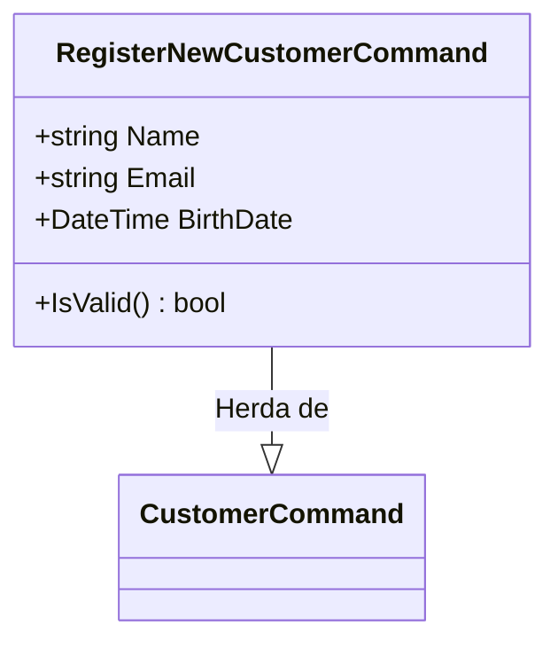

# RegisterNewCustomerCommand.cs: Registro de Novos Clientes

## Visão Geral
Este código é uma estrutura de dados que representa o comando para registrar um novo cliente no sistema. Ele herda da classe `CustomerCommand` e inclui um método para validar a entrada do usuário.

## Fluxo do Processo

## Insights
- A classe `RegisterNewCustomerCommand` herda da classe `CustomerCommand`.
- A classe `RegisterNewCustomerCommand` possui três atributos: `Name`, `Email` e `BirthDate`.
- A classe `RegisterNewCustomerCommand` possui um método `IsValid()` que valida os dados do novo cliente.

## Dependências (Opcional)

- `RegisterNewCustomerCommandValidation` : É usado para validar os dados do novo cliente.

## Vulnerabilidades
- O código não possui nenhuma verificação explícita de nulidade ou validação de formato para os campos `Name` e `Email`, o que pode levar a erros em tempo de execução se os dados não forem fornecidos corretamente.
- Não há nenhuma verificação de unicidade para o campo `Email`, o que pode levar a duplicação de registros se o mesmo email for usado para registrar diferentes clientes.