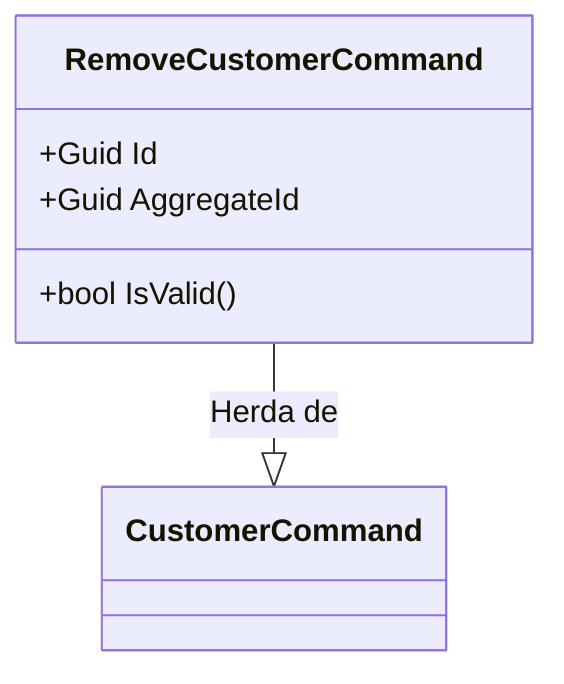
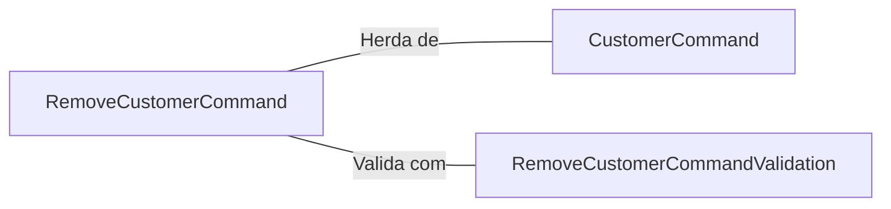

# RemoveCustomerCommand.cs: Comando para Remover Cliente

## Visão Geral
Este arquivo define a estrutura de dados `RemoveCustomerCommand`, que é um comando específico para remover um cliente no domínio da aplicação. Este comando herda de `CustomerCommand` e inclui um método para validar o comando.

## Fluxo do Processo

## Insights
- A estrutura de dados `RemoveCustomerCommand` herda de `CustomerCommand`.
- O comando `RemoveCustomerCommand` é inicializado com um `id` que é usado para definir tanto o `Id` quanto o `AggregateId`.
- O método `IsValid` é usado para validar o comando. Ele usa a classe `RemoveCustomerCommandValidation` para realizar a validação e retorna um booleano indicando se a validação foi bem-sucedida ou não.

## Dependências (Opcional)
- `CustomerCommand`: Classe base da qual `RemoveCustomerCommand` herda.
- `RemoveCustomerCommandValidation`: Classe usada para validar o comando `RemoveCustomerCommand`.

- `CustomerCommand`: Classe base que fornece a estrutura para comandos relacionados a clientes.
- `RemoveCustomerCommandValidation`: Classe usada para validar o comando `RemoveCustomerCommand`. Ela é chamada no método `IsValid`.

## Vulnerabilidades
- O método `IsValid` retorna um booleano que indica se a validação foi bem-sucedida ou não. No entanto, não há indicação de quais regras de validação falharam, o que pode dificultar a depuração e a correção de erros.
- O `Id` é usado para definir tanto o `Id` quanto o `AggregateId`. Se o `Id` for alterado após a criação do comando, isso pode levar a um estado inconsistente.