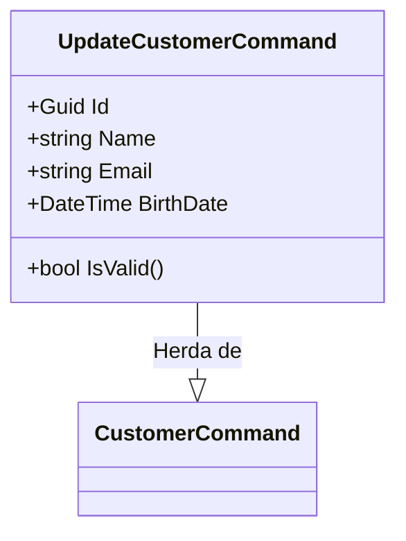
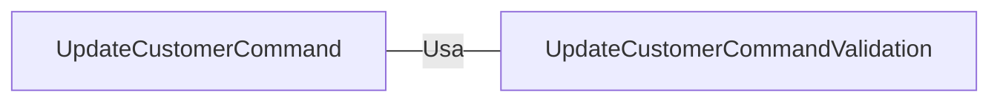

# UpdateCustomerCommand.cs: Atualização de Cliente

## Visão Geral
O código é uma estrutura de dados que representa um comando para atualizar um cliente no domínio da aplicação. Ele herda de `CustomerCommand` e inclui um método para validar se o comando é válido.

## Fluxo do Processo

## Insights
- A estrutura de dados `UpdateCustomerCommand` herda de `CustomerCommand`.
- A estrutura de dados `UpdateCustomerCommand` contém quatro atributos: `Id`, `Name`, `Email` e `BirthDate`.
- A estrutura de dados `UpdateCustomerCommand` contém um método `IsValid` que valida o comando usando `UpdateCustomerCommandValidation`.

## Dependências (Opcional)

- `UpdateCustomerCommandValidation` : É usado para validar o comando `UpdateCustomerCommand`.

## Vulnerabilidades
Não foram identificadas vulnerabilidades explícitas no código. No entanto, é importante garantir que os dados de entrada sejam validados corretamente para evitar ataques de injeção de SQL ou XSS. Além disso, é importante garantir que o código esteja protegido contra ataques de força bruta tentando adivinhar o `Id` do cliente.