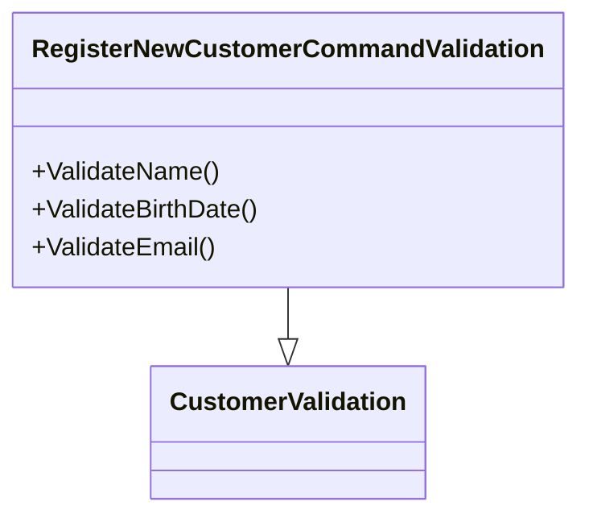
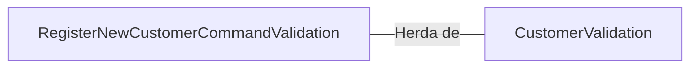

# RegisterNewCustomerCommandValidation.cs: Validação do Comando de Registro de Novo Cliente

## Visão Geral
Este arquivo define uma estrutura de dados chamada `RegisterNewCustomerCommandValidation`, que herda de `CustomerValidation<RegisterNewCustomerCommand>`. Esta estrutura é responsável por validar os dados de um novo cliente durante o registro.

## Fluxo do Processo

A estrutura `RegisterNewCustomerCommandValidation` herda de `CustomerValidation<RegisterNewCustomerCommand>`. Ela possui três métodos: `ValidateName()`, `ValidateBirthDate()` e `ValidateEmail()`, que são chamados quando um novo objeto `RegisterNewCustomerCommandValidation` é criado.

## Insights
- A estrutura `RegisterNewCustomerCommandValidation` é usada para validar os dados de um novo cliente durante o registro.
- Ela herda de `CustomerValidation<RegisterNewCustomerCommand>`, o que sugere que ela pode compartilhar alguns comportamentos e características com outras estruturas de validação de clientes.
- Os métodos `ValidateName()`, `ValidateBirthDate()` e `ValidateEmail()` são chamados no construtor, o que significa que eles são executados sempre que um novo objeto `RegisterNewCustomerCommandValidation` é criado.

## Dependências (Opcional)

- `CustomerValidation<RegisterNewCustomerCommand>`: A estrutura `RegisterNewCustomerCommandValidation` herda de `CustomerValidation<RegisterNewCustomerCommand>`. Isso significa que ela pode usar seus métodos e propriedades, e que qualquer alteração em `CustomerValidation<RegisterNewCustomerCommand>` pode afetar `RegisterNewCustomerCommandValidation`.

## Vulnerabilidades
- Como os métodos de validação são chamados no construtor, se algum deles lançar uma exceção, o objeto `RegisterNewCustomerCommandValidation` não será criado. Isso pode ser uma vulnerabilidade se não for tratado corretamente.
- Se a estrutura `CustomerValidation<RegisterNewCustomerCommand>` for alterada, isso pode afetar a `RegisterNewCustomerCommandValidation`, pois ela herda de `CustomerValidation<RegisterNewCustomerCommand>`. Isso pode ser uma vulnerabilidade se as alterações não forem devidamente testadas.