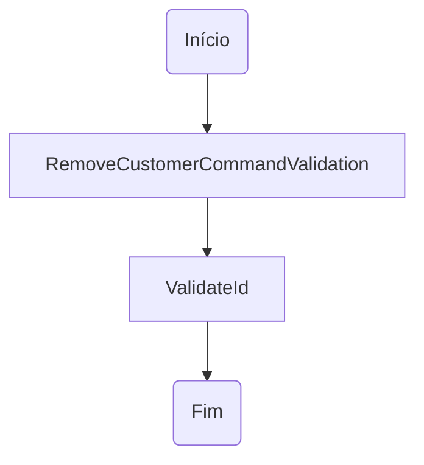

# RemoveCustomerCommandValidation.cs: Validação do Comando de Remoção de Cliente

## Visão Geral
Este arquivo contém a definição da classe `RemoveCustomerCommandValidation`, que é responsável por validar o comando de remoção de um cliente. A classe herda de `CustomerValidation<RemoveCustomerCommand>`, o que significa que ela utiliza a validação definida na classe base, especificamente a validação do ID do cliente.

## Fluxo do Processo

Este diagrama de fluxo de processo mostra que a classe `RemoveCustomerCommandValidation` é instanciada e, em seguida, o método `ValidateId` é chamado para validar o ID do cliente.

## Insights
- A classe `RemoveCustomerCommandValidation` é uma classe de validação específica para o comando de remoção de um cliente.
- A validação do ID do cliente é realizada através do método `ValidateId` da classe base `CustomerValidation`.

## Dependências (Opcional)
Não foram identificadas dependências externas neste código.

## Manipulação de Dados (SQL) (Opcional)
Não há manipulação de dados SQL neste código.