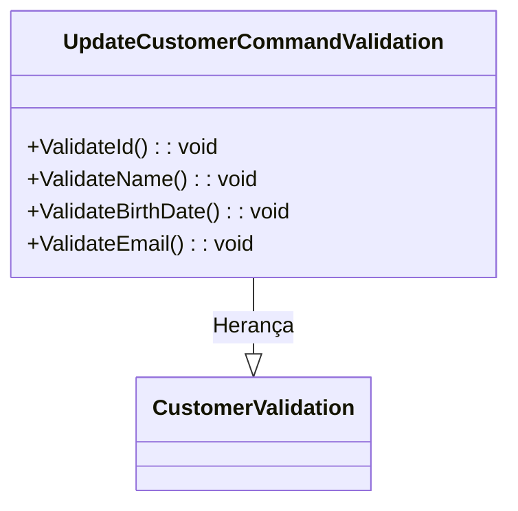

# UpdateCustomerCommandValidation.cs: Validação de Atualização de Cliente

## Visão Geral
Este arquivo contém a definição de uma estrutura de dados chamada `UpdateCustomerCommandValidation`, que herda de `CustomerValidation<UpdateCustomerCommand>`. Esta estrutura de dados é responsável por validar os dados de um cliente durante uma operação de atualização.

## Fluxo do Processo
Como esta é uma estrutura de dados, um diagrama de classe é mais apropriado para representar suas características.

## Insights
- A estrutura de dados `UpdateCustomerCommandValidation` herda de `CustomerValidation<UpdateCustomerCommand>`, o que sugere que ela compartilha algumas características e comportamentos com a classe base.
- A estrutura de dados `UpdateCustomerCommandValidation` define quatro métodos de validação: `ValidateId()`, `ValidateName()`, `ValidateBirthDate()` e `ValidateEmail()`. Esses métodos são usados para validar os dados do cliente durante uma operação de atualização.

## Dependências (Opcional)
- `CustomerValidation<UpdateCustomerCommand>`: Esta é a classe base da qual `UpdateCustomerCommandValidation` herda. Ela provavelmente define alguns comportamentos e características comuns que são compartilhados por suas classes derivadas.

- `CustomerValidation<UpdateCustomerCommand>`: `UpdateCustomerCommandValidation` herda desta classe. Ela provavelmente define alguns comportamentos e características comuns que são compartilhados por suas classes derivadas.

## Vulnerabilidades
Não foram identificadas vulnerabilidades específicas neste código. No entanto, é importante notar que a segurança e a robustez das validações implementadas pelos métodos `ValidateId()`, `ValidateName()`, `ValidateBirthDate()` e `ValidateEmail()` são cruciais para a segurança dos dados do cliente. Se essas validações forem insuficientes ou mal implementadas, elas podem permitir a entrada de dados inválidos ou maliciosos.