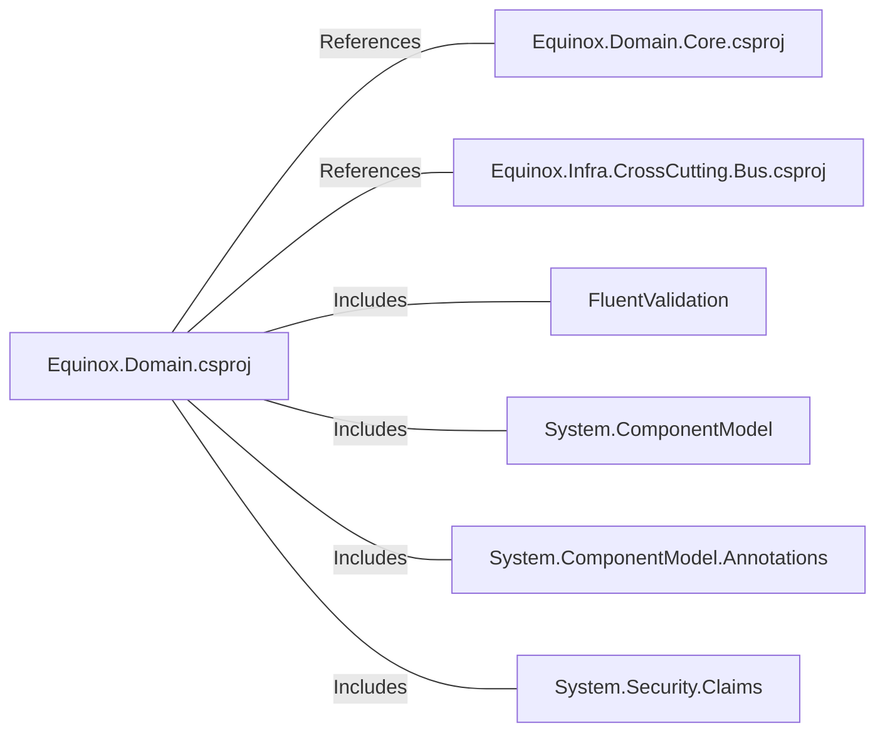

# Equinox.Domain.csproj: Projeto de Domínio Equinox

## Visão Geral
Este é um projeto de domínio do Equinox, que define o framework alvo e as dependências do projeto. O projeto de domínio é uma parte essencial da arquitetura de software, pois define as regras de negócio e as entidades do domínio.

## Fluxo do Processo
Como este é um arquivo de projeto e não contém lógica de programação, um diagrama de fluxo de processo não é aplicável. No entanto, as dependências do projeto são claramente definidas no arquivo.

## Insights
- O projeto está configurado para usar o .NET 6.0 como seu framework alvo.
- O projeto tem referências a outros dois projetos: `Equinox.Domain.Core.csproj` e `Equinox.Infra.CrossCutting.Bus.csproj`.
- O projeto tem dependências de pacotes que incluem FluentValidation, System.ComponentModel, System.ComponentModel.Annotations e System.Security.Claims.

## Dependências
O projeto tem dependências externas que são referenciadas no arquivo de projeto. Essas dependências incluem projetos e pacotes.

- `Equinox.Domain.Core.csproj`: Este é um projeto de referência que provavelmente contém a lógica do domínio central do aplicativo.
- `Equinox.Infra.CrossCutting.Bus.csproj`: Este é um projeto de referência que provavelmente contém a lógica para um barramento de mensagens ou um mecanismo de comunicação entre componentes.
- `FluentValidation`: Este pacote é usado para validação de modelo ou entidade.
- `System.ComponentModel`: Este pacote fornece classes que são usadas para implementar o modelo de componente e controle de eventos.
- `System.ComponentModel.Annotations`: Este pacote fornece classes de atributo que são usadas para definir metadados para classes de modelo de dados ASP.NET.
- `System.Security.Claims`: Este pacote fornece tipos que são usados para implementar a autenticação baseada em reivindicações e autorização.

## Vulnerabilidades
Não foram identificadas vulnerabilidades específicas no código. No entanto, é importante garantir que todas as dependências do projeto estejam atualizadas e livres de vulnerabilidades conhecidas. Além disso, o uso adequado de pacotes como `System.Security.Claims` é crucial para garantir a segurança do aplicativo.