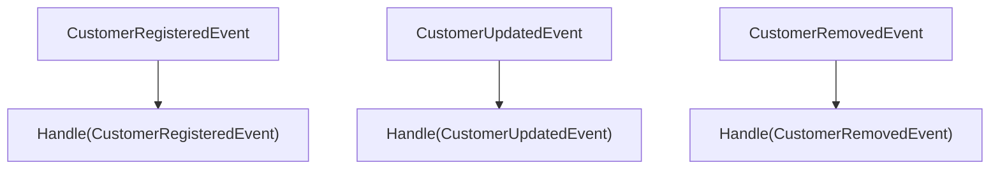
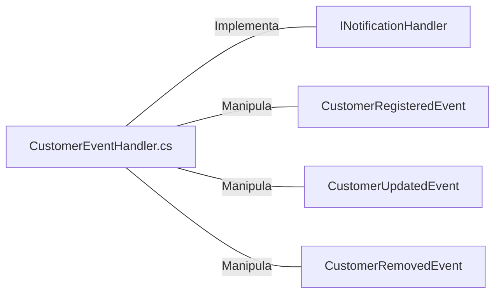

# CustomerEventHandler.cs: Manipulador de Eventos do Cliente

## Visão Geral
Este código é responsável por manipular eventos relacionados a clientes em um sistema. Ele implementa a interface `INotificationHandler` do MediatR para três tipos de eventos: `CustomerRegisteredEvent`, `CustomerUpdatedEvent` e `CustomerRemovedEvent`. Para cada tipo de evento, ele executa uma ação específica, que neste caso é enviar um e-mail de notificação.

## Fluxo do Processo

O diagrama acima mostra o fluxo do processo para cada tipo de evento. Quando um evento é disparado, o método correspondente é chamado para lidar com esse evento.

## Insights
- O código é uma implementação do padrão de design Observer, onde o `CustomerEventHandler` atua como o observador.
- O código não executa nenhuma ação real além de retornar uma `Task.CompletedTask`. Os comentários indicam que um e-mail de notificação deve ser enviado, mas a implementação real não está presente.
- O código é altamente acoplado à biblioteca MediatR, pois depende diretamente da interface `INotificationHandler`.

## Dependências

- `INotificationHandler`: Interface do MediatR que o `CustomerEventHandler` implementa. É usada para definir os métodos de manipulação de eventos.
- `CustomerRegisteredEvent`: Evento disparado quando um cliente é registrado. O `CustomerEventHandler` manipula este evento.
- `CustomerUpdatedEvent`: Evento disparado quando um cliente é atualizado. O `CustomerEventHandler` manipula este evento.
- `CustomerRemovedEvent`: Evento disparado quando um cliente é removido. O `CustomerEventHandler` manipula este evento.

## Vulnerabilidades
- O código não possui nenhuma validação ou tratamento de erros, o que pode levar a falhas se os eventos não forem disparados corretamente.
- A dependência direta da interface `INotificationHandler` do MediatR pode dificultar a realização de testes unitários ou a substituição por outra biblioteca de manipulação de eventos no futuro.
- A falta de implementação real dos métodos de manipulação de eventos significa que o código atualmente não tem funcionalidade útil.