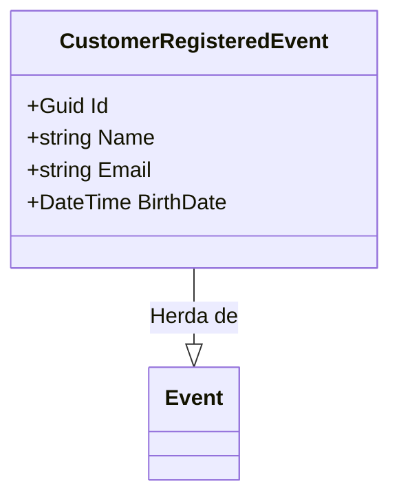

# CustomerRegisteredEvent.cs: Evento de Registro de Cliente

## Visão Geral
Este arquivo define uma estrutura de dados chamada `CustomerRegisteredEvent`, que é usada para representar um evento de registro de cliente no domínio do aplicativo. Esta estrutura de dados herda da classe `Event` e contém informações como `Id`, `Name`, `Email` e `BirthDate`.

## Fluxo do Processo
Como este arquivo define uma estrutura de dados e não contém lógica de programação, um diagrama de classe é mais apropriado para representar suas características.

## Insights
- A estrutura de dados `CustomerRegisteredEvent` é usada para representar um evento de registro de cliente.
- Esta estrutura de dados contém quatro propriedades: `Id`, `Name`, `Email` e `BirthDate`.
- A propriedade `Id` é usada para identificar unicamente o evento.
- As propriedades `Name`, `Email` e `BirthDate` são usadas para armazenar informações sobre o cliente que se registrou.
- A estrutura de dados `CustomerRegisteredEvent` herda da classe `Event`, o que significa que ela pode ser usada onde quer que um objeto `Event` seja esperado.

## Dependências (Opcional)
Este arquivo não parece ter dependências externas, portanto, esta seção não é aplicável.

## Manipulação de Dados (SQL) (Opcional)
Este arquivo não realiza nenhuma operação SQL, portanto, esta seção não é aplicável.

## Vulnerabilidades
Não foram identificadas vulnerabilidades no código.