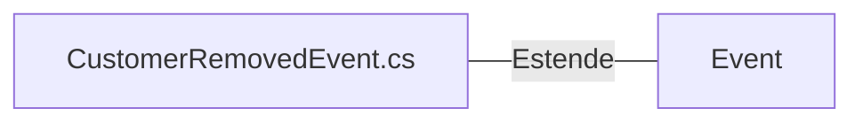

# CustomerRemovedEvent.cs: Evento de Remoção de Cliente

## Visão Geral
Este arquivo define uma estrutura de dados chamada `CustomerRemovedEvent`, que é um evento que ocorre quando um cliente é removido. Este evento é uma extensão da classe `Event` do pacote `NetDevPack.Messaging`.

## Fluxo do Processo
Como `CustomerRemovedEvent` é uma estrutura de dados, não há um fluxo de processo específico associado a ela. No entanto, ela possui os seguintes atributos:

| Atributo | Tipo | Descrição |
| --- | --- | --- |
| Id | Guid | Identificador único do evento. |
| AggregateId | Guid | Identificador agregado, que neste caso é o mesmo que o Id. |

## Insights
- `CustomerRemovedEvent` é uma estrutura de dados que representa um evento específico no domínio do problema, ou seja, a remoção de um cliente.
- Esta estrutura de dados estende a classe `Event`, que é parte do pacote `NetDevPack.Messaging`, indicando que ela é usada para comunicação entre diferentes partes do sistema.

## Dependências (Opcional)
Este arquivo tem uma dependência externa:

- `Event`: Esta é a classe base que `CustomerRemovedEvent` estende. Ela é parte do pacote `NetDevPack.Messaging` e provê a funcionalidade básica para a criação de eventos no sistema.

## Vulnerabilidades
Não foram identificadas vulnerabilidades específicas neste código. No entanto, é importante garantir que o uso de eventos como `CustomerRemovedEvent` seja adequadamente protegido e gerenciado para evitar problemas de segurança, como a exposição de informações sensíveis ou a execução não autorizada de ações no sistema.