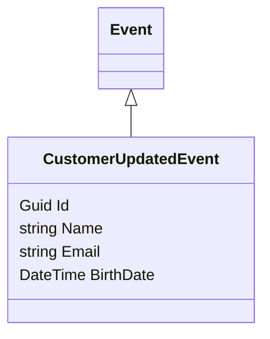

# CustomerUpdatedEvent.cs: Evento de Atualização de Cliente

## Visão Geral
Este arquivo define uma estrutura de dados chamada `CustomerUpdatedEvent`, que é usada para representar um evento de atualização de cliente no domínio do aplicativo. Esta estrutura de dados herda da classe `Event` e contém informações sobre o cliente que foi atualizado, incluindo seu ID, nome, email e data de nascimento.

## Fluxo do Processo
Como este arquivo define uma estrutura de dados e não contém lógica de programação, um diagrama de classe é mais apropriado para representar suas informações.

## Insights
- A estrutura de dados `CustomerUpdatedEvent` é usada para representar um evento de atualização de cliente.
- Esta estrutura de dados contém quatro propriedades: `Id`, `Name`, `Email` e `BirthDate`.
- A propriedade `Id` é usada para identificar o cliente que foi atualizado.
- As propriedades `Name`, `Email` e `BirthDate` são usadas para armazenar as informações atualizadas do cliente.
- A estrutura de dados `CustomerUpdatedEvent` herda da classe `Event`, o que significa que ela pode ser usada em qualquer lugar onde um `Event` é esperado.

## Dependências (Opcional)
Este arquivo não parece ter dependências externas, portanto, esta seção não é aplicável.

## Manipulação de Dados (SQL) (Opcional)
Este arquivo não realiza nenhuma operação de manipulação de dados SQL, portanto, esta seção não é aplicável.

## Vulnerabilidades
Não foram identificadas vulnerabilidades específicas neste código. No entanto, é importante garantir que os dados do cliente sejam sempre tratados de maneira segura e confidencial para proteger a privacidade do cliente. Além disso, qualquer lógica que utilize esta estrutura de dados deve lidar adequadamente com possíveis exceções e erros para evitar interrupções no fluxo de trabalho.