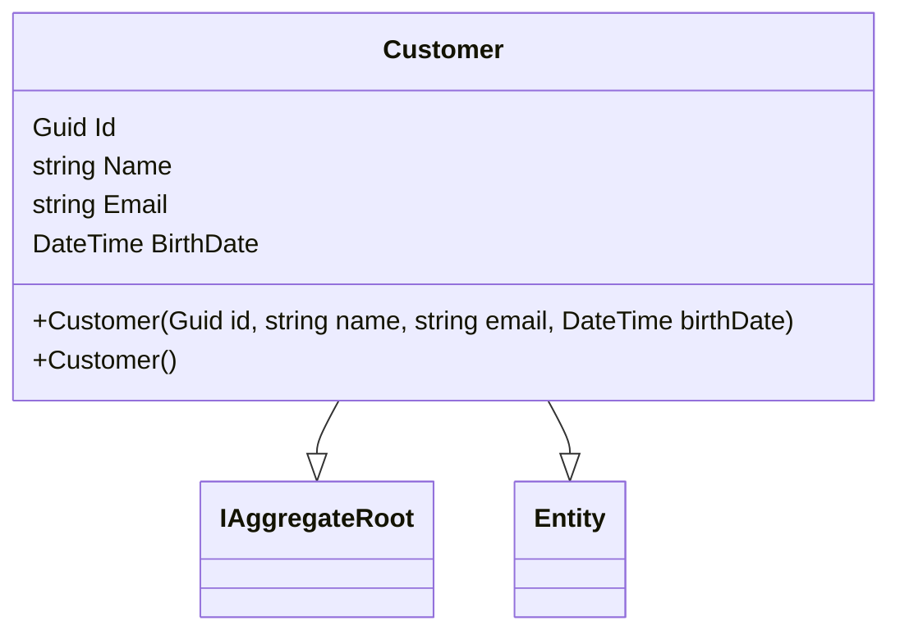

# Customer.cs: Modelo de Domínio do Cliente

## Visão Geral
Este arquivo define a estrutura de dados para o objeto `Customer` (Cliente) no domínio da aplicação. O objeto `Customer` é uma entidade que implementa a interface `IAggregateRoot` e possui os seguintes atributos: `Id`, `Name`, `Email` e `BirthDate`.

## Fluxo do Processo
Como este arquivo é uma estrutura de dados e não contém lógica de programação, um diagrama de classe é mais apropriado para representar suas informações.

## Insights
- A classe `Customer` herda de `Entity` e implementa a interface `IAggregateRoot`.
- A classe `Customer` possui um construtor com parâmetros que inicializa o `Id`, `Name`, `Email` e `BirthDate`.
- A classe `Customer` também possui um construtor vazio protegido, provavelmente para ser usado pelo Entity Framework.
- Os atributos `Name`, `Email` e `BirthDate` são privados para definição (set), o que significa que eles só podem ser definidos dentro da classe `Customer`.

## Dependências (Opcional)
Não foram identificadas dependências externas neste código.

## Manipulação de Dados (SQL) (Opcional)
Não há manipulação de SQL neste código.

## Vulnerabilidades
Não foram identificadas vulnerabilidades neste código.