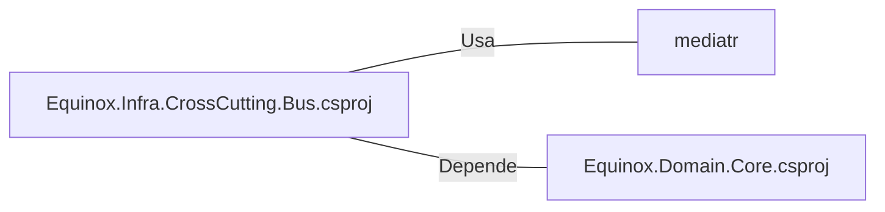

# Equinox.Infra.CrossCutting.Bus.csproj: Gerenciamento de Dependências do Projeto

## Visão Geral
Este arquivo de projeto define as configurações e dependências para o projeto `Equinox.Infra.CrossCutting.Bus`. Ele especifica que o projeto está usando o .NET 6.0 como framework de destino e inclui referências a pacotes e projetos externos.

## Fluxo do Processo
Como este é um arquivo de configuração de projeto, não há um fluxo de processo específico a ser documentado. No entanto, ele define as dependências do projeto, que são cruciais para o funcionamento correto do projeto.

## Insights
- O projeto está usando o .NET 6.0 como framework de destino.
- O projeto tem uma dependência no pacote `mediatr` versão `10.0.1`.
- O projeto tem uma dependência no projeto `Equinox.Domain.Core`.

## Dependências
O arquivo de projeto tem duas dependências externas:

- `mediatr` : O projeto usa o pacote `mediatr` versão `10.0.1`. Este pacote é usado para implementar o padrão Mediator, que ajuda a reduzir o acoplamento entre classes e é útil na implementação de CQRS (Command Query Responsibility Segregation).
- `Equinox.Domain.Core.csproj` : O projeto tem uma dependência no projeto `Equinox.Domain.Core`. Este projeto provavelmente contém as classes de domínio e interfaces que são usadas neste projeto.

## Vulnerabilidades
Não foram identificadas vulnerabilidades específicas neste arquivo de projeto. No entanto, é importante garantir que as versões dos pacotes e projetos externos usados sejam mantidos atualizados para evitar possíveis vulnerabilidades de segurança conhecidas.