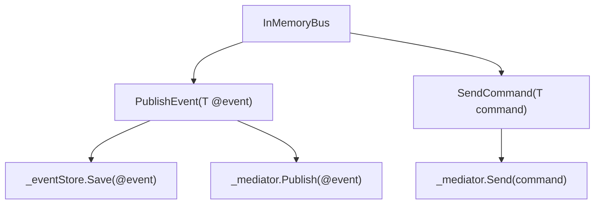

# InMemoryBus.cs: Gerenciador de Eventos e Comandos em Memória

## Visão Geral
O arquivo `InMemoryBus.cs` define uma classe `InMemoryBus` que implementa a interface `IMediatorHandler`. Esta classe é responsável por publicar eventos e enviar comandos usando o padrão de design Mediator. A classe `InMemoryBus` usa uma instância de `IMediator` para publicar eventos e enviar comandos, e uma instância de `IEventStore` para armazenar eventos.

## Fluxo do Processo

## Insights
- A classe `InMemoryBus` é selada, o que significa que ela não pode ser herdada.
- A classe `InMemoryBus` usa injeção de dependência para obter instâncias de `IEventStore` e `IMediator`.
- O método `PublishEvent<T>` publica um evento e o armazena no `IEventStore` se o tipo de mensagem do evento não for "DomainNotification".
- O método `SendCommand<T>` envia um comando e retorna um `ValidationResult`.

## Dependências

- `IMediator`: Usado para publicar eventos e enviar comandos.
- `IEventStore`: Usado para armazenar eventos.

## Vulnerabilidades
- O método `PublishEvent<T>` não verifica se o `IEventStore` é nulo antes de chamar o método `Save`. Isso pode resultar em uma exceção `NullReferenceException` se o `IEventStore` for nulo.
- O método `SendCommand<T>` não verifica se o `IMediator` é nulo antes de chamar o método `Send`. Isso pode resultar em uma exceção `NullReferenceException` se o `IMediator` for nulo.