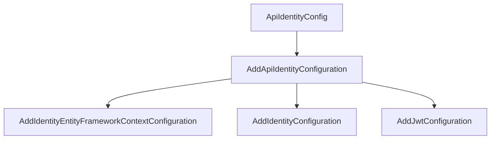
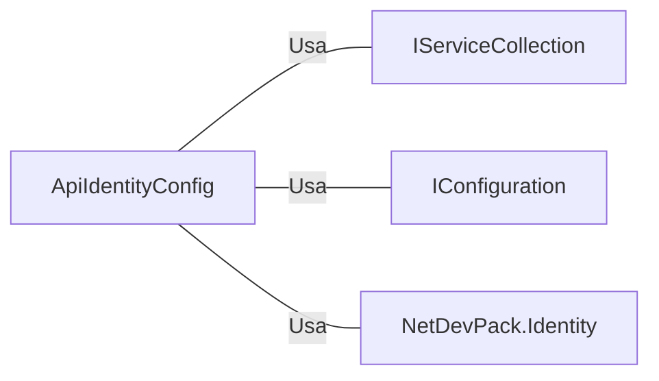

# ApiIdentityConfig.cs: Configuração de Identidade da API

## Visão Geral
Este arquivo contém a classe estática `ApiIdentityConfig` que é responsável por configurar a identidade da API, incluindo a configuração do Entity Framework Context para a identidade, a configuração padrão da identidade e a configuração JWT.

## Fluxo do Processo

Neste diagrama, `ApiIdentityConfig` é a classe que contém o método `AddApiIdentityConfiguration`. Este método, por sua vez, chama três outros métodos para configurar a identidade da API:
- `AddIdentityEntityFrameworkContextConfiguration`: Configura o Entity Framework Context para a identidade.
- `AddIdentityConfiguration`: Configura a identidade padrão.
- `AddJwtConfiguration`: Configura o JWT.

## Insights
- A classe `ApiIdentityConfig` é uma classe estática, o que significa que ela não pode ser instanciada e seus membros podem ser acessados diretamente.
- O método `AddApiIdentityConfiguration` é uma extensão do `IServiceCollection`, permitindo que ele seja chamado diretamente em uma instância de `IServiceCollection`.
- A configuração do Entity Framework Context para a identidade é feita usando a string de conexão "DefaultConnection" e o assembly de migrações "Equinox.Infra.CrossCutting.Identity".
- A configuração JWT é feita usando a seção de configuração "AppSettings".

## Dependências (Opcional)

- `IServiceCollection`: Usado para adicionar serviços ao contêiner de injeção de dependência. No método `AddApiIdentityConfiguration`, é usado para adicionar a configuração do Entity Framework Context para a identidade, a configuração padrão da identidade e a configuração JWT.
- `IConfiguration`: Usado para acessar as configurações do aplicativo. No método `AddApiIdentityConfiguration`, é usado para obter a string de conexão "DefaultConnection" e a seção de configuração "AppSettings".
- `NetDevPack.Identity`: Usado para configurar a identidade da API. No método `AddApiIdentityConfiguration`, é usado para adicionar a configuração do Entity Framework Context para a identidade, a configuração padrão da identidade e a configuração JWT.

## Vulnerabilidades
- A string de conexão "DefaultConnection" e a seção de configuração "AppSettings" são obtidas diretamente da configuração do aplicativo, o que pode representar um risco de segurança se as configurações não forem devidamente protegidas.
- O assembly de migrações "Equinox.Infra.CrossCutting.Identity" é especificado diretamente no código, o que pode representar um risco se o assembly não for devidamente protegido.