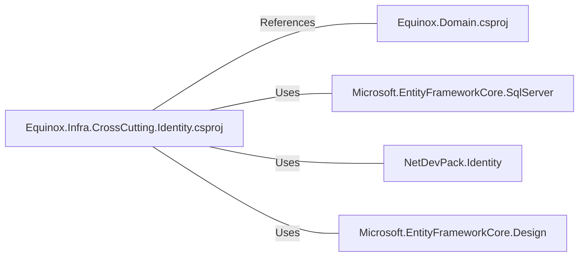

# Equinox.Infra.CrossCutting.Identity.csproj: Projeto de Identidade CrossCutting do Equinox

## Visão Geral
Este é um projeto de identidade CrossCutting do Equinox, que é uma parte do sistema de gerenciamento de identidade. Ele é responsável por fornecer funcionalidades relacionadas à identidade do usuário, como autenticação e autorização. O projeto é construído usando o .NET 6.0 e faz referência ao projeto Equinox.Domain.

## Fluxo do Processo
Como este é um arquivo de projeto e não contém lógica de programação, um diagrama de fluxo de processo não é aplicável. No entanto, ele contém referências a outros projetos e pacotes, que são detalhados na seção de dependências.

## Insights
- O projeto é construído usando o .NET 6.0, conforme especificado na tag `<TargetFramework>`.
- O projeto faz referência ao projeto Equinox.Domain, conforme especificado na tag `<ProjectReference>`.
- O projeto usa os seguintes pacotes:
  - Microsoft.EntityFrameworkCore.SqlServer versão 6.0.3
  - NetDevPack.Identity versão 6.0.5
  - Microsoft.EntityFrameworkCore.Design versão 6.0.3

## Dependências
O projeto tem as seguintes dependências externas:

- `Equinox.Domain.csproj`: Este é um projeto de domínio que contém as regras de negócio e as entidades de domínio. O projeto de identidade faz referência a ele para acessar essas entidades e regras.
- `Microsoft.EntityFrameworkCore.SqlServer`: Este é um provedor de banco de dados para o Entity Framework Core que permite o uso do SQL Server. O projeto de identidade usa este pacote para interagir com o banco de dados SQL Server.
- `NetDevPack.Identity`: Este é um pacote que fornece funcionalidades de identidade, como autenticação e autorização. O projeto de identidade usa este pacote para gerenciar a identidade do usuário.
- `Microsoft.EntityFrameworkCore.Design`: Este é um pacote que fornece funcionalidades para projetar o contexto do banco de dados e as entidades do Entity Framework Core. O projeto de identidade usa este pacote para projetar o contexto do banco de dados e as entidades.

## Vulnerabilidades
Como este é um arquivo de projeto e não contém código de programação, não há vulnerabilidades de código a serem destacadas. No entanto, é importante garantir que as versões dos pacotes usados sejam mantidas atualizadas para evitar possíveis vulnerabilidades de segurança conhecidas nesses pacotes.