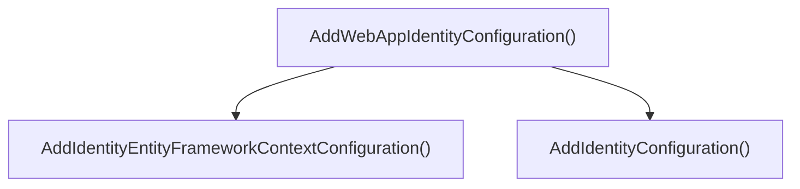
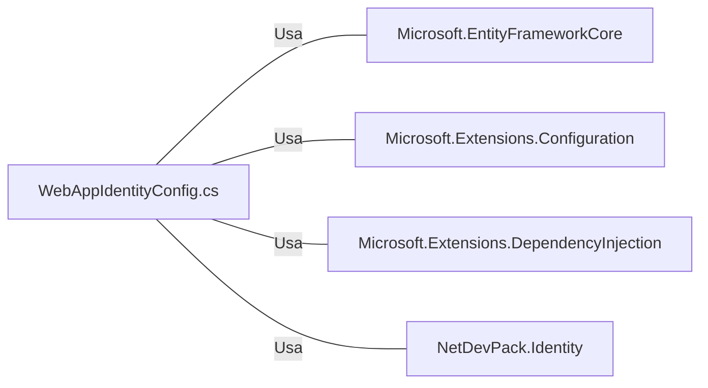

# WebAppIdentityConfig.cs: Configuração de Identidade do Aplicativo Web

## Visão Geral
Este arquivo contém a configuração de identidade para um aplicativo web. Ele define a configuração do Entity Framework para a identidade e a configuração padrão da identidade.

## Fluxo do Processo

Este diagrama de fluxo de processo mostra que a função `AddWebAppIdentityConfiguration()` chama duas funções: `AddIdentityEntityFrameworkContextConfiguration()` e `AddIdentityConfiguration()`.

## Insights
- A função `AddWebAppIdentityConfiguration()` é uma extensão do `IServiceCollection` que configura a identidade do aplicativo web.
- A função `AddIdentityEntityFrameworkContextConfiguration()` é usada para configurar o contexto do Entity Framework para a identidade.
- A função `AddIdentityConfiguration()` é usada para configurar a identidade padrão.

## Dependências (Opcional)
Este código depende das seguintes bibliotecas externas:
- Microsoft.EntityFrameworkCore
- Microsoft.Extensions.Configuration
- Microsoft.Extensions.DependencyInjection
- NetDevPack.Identity

Este diagrama mostra que o arquivo `WebAppIdentityConfig.cs` usa as bibliotecas `Microsoft.EntityFrameworkCore`, `Microsoft.Extensions.Configuration`, `Microsoft.Extensions.DependencyInjection` e `NetDevPack.Identity`.

## Vulnerabilidades
Não foram identificadas vulnerabilidades específicas neste código. No entanto, é importante garantir que a string de conexão do banco de dados seja segura e que as configurações de identidade sejam apropriadas para o ambiente de produção.