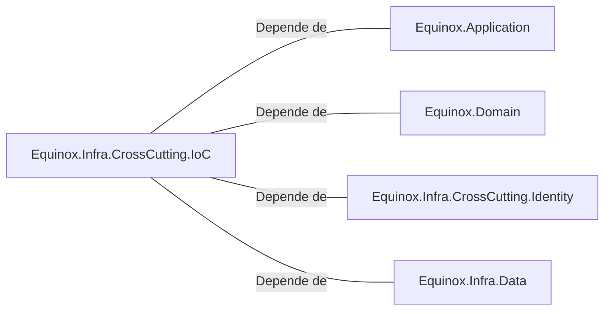

# Equinox.Infra.CrossCutting.IoC.csproj: Configuração de Dependências do Projeto

## Visão Geral
Este arquivo de projeto C# (.csproj) é responsável por definir as dependências do projeto `Equinox.Infra.CrossCutting.IoC`. Ele especifica que o projeto depende de outros quatro projetos, que são: `Equinox.Application`, `Equinox.Domain`, `Equinox.Infra.CrossCutting.Identity` e `Equinox.Infra.Data`.

## Fluxo do Processo
Como este arquivo é uma estrutura de dados (arquivo de projeto) e não contém lógica de programação, um diagrama de classes ou fluxo de processo não seria aplicável. No entanto, os atributos principais podem ser listados em uma tabela:

| Atributo | Descrição |
|----------|-----------|
| Sdk | Define o SDK do .NET a ser usado. Neste caso, é o "Microsoft.NET.Sdk". |
| TargetFramework | Define a versão do framework .NET a ser usada. Neste caso, é o "net6.0". |
| ProjectReference | Define as dependências do projeto. Neste caso, são quatro projetos: `Equinox.Application`, `Equinox.Domain`, `Equinox.Infra.CrossCutting.Identity` e `Equinox.Infra.Data`. |

## Insights
- O projeto está usando a versão mais recente do .NET, o .NET 6.0.
- O projeto tem dependências claras e bem definidas, o que facilita o gerenciamento e a manutenção do código.

## Dependências
O projeto `Equinox.Infra.CrossCutting.IoC` tem dependências em quatro outros projetos. Abaixo está um diagrama de dependências e uma lista detalhada das dependências.

- `Equinox.Application` : O projeto `Equinox.Infra.CrossCutting.IoC` depende deste projeto para acessar as funcionalidades e lógicas de aplicação.
- `Equinox.Domain` : O projeto `Equinox.Infra.CrossCutting.IoC` depende deste projeto para acessar as entidades e lógicas de domínio.
- `Equinox.Infra.CrossCutting.Identity` : O projeto `Equinox.Infra.CrossCutting.IoC` depende deste projeto para acessar as funcionalidades e lógicas de identidade.
- `Equinox.Infra.Data` : O projeto `Equinox.Infra.CrossCutting.IoC` depende deste projeto para acessar as funcionalidades e lógicas de acesso a dados.

## Vulnerabilidades
Como este é um arquivo de configuração de projeto e não contém lógica de programação, não há vulnerabilidades de código a serem consideradas. No entanto, é importante garantir que as versões dos projetos dependentes sejam compatíveis e estejam atualizadas para evitar possíveis problemas de incompatibilidade ou uso de versões desatualizadas com vulnerabilidades conhecidas.