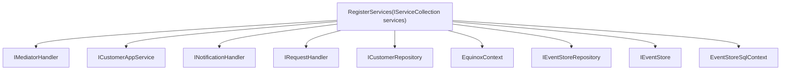
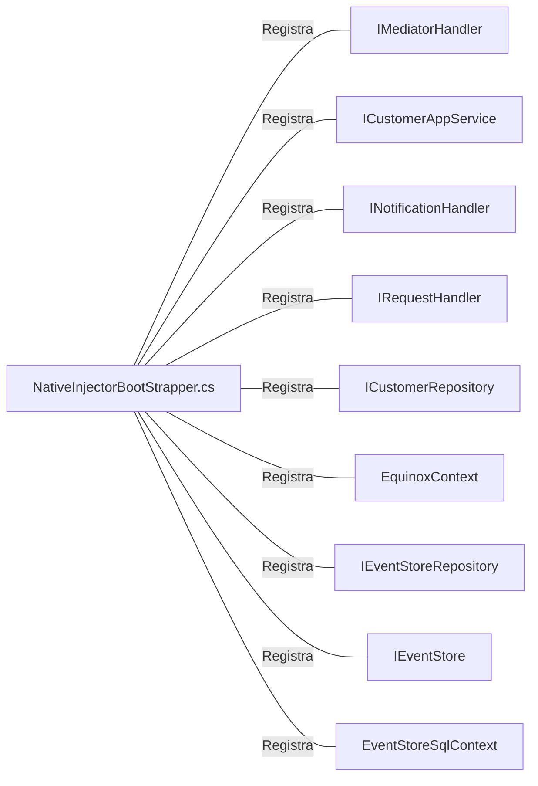

# NativeInjectorBootStrapper.cs: Injeção de Dependências

## Visão Geral
Este arquivo é responsável por configurar a injeção de dependências para a aplicação. Ele registra os serviços necessários para o funcionamento do sistema, incluindo serviços de domínio, aplicação, infraestrutura de dados e manipulação de eventos.

## Fluxo do Processo

## Insights
- O método `RegisterServices` é responsável por registrar todos os serviços necessários para a aplicação.
- Os serviços de domínio, aplicação, infraestrutura de dados e manipulação de eventos são registrados.
- O padrão de injeção de dependências é utilizado para garantir a inversão de controle e a baixa acoplamento entre as classes.

## Dependências

- `IMediatorHandler`: Interface para o manipulador de mediador. É utilizada para enviar comandos e publicar eventos.
- `ICustomerAppService`: Interface para o serviço de aplicação do cliente. É utilizada para realizar operações relacionadas ao cliente.
- `INotificationHandler`: Interface para o manipulador de notificações. É utilizada para lidar com eventos de domínio.
- `IRequestHandler`: Interface para o manipulador de solicitações. É utilizada para lidar com comandos de domínio.
- `ICustomerRepository`: Interface para o repositório do cliente. É utilizada para realizar operações de banco de dados relacionadas ao cliente.
- `EquinoxContext`: Contexto do banco de dados.
- `IEventStoreRepository`: Interface para o repositório de armazenamento de eventos. É utilizada para realizar operações de banco de dados relacionadas ao armazenamento de eventos.
- `IEventStore`: Interface para o armazenamento de eventos. É utilizada para armazenar eventos de domínio.
- `EventStoreSqlContext`: Contexto do banco de dados para o armazenamento de eventos.

## Vulnerabilidades
Não foram identificadas vulnerabilidades no código.