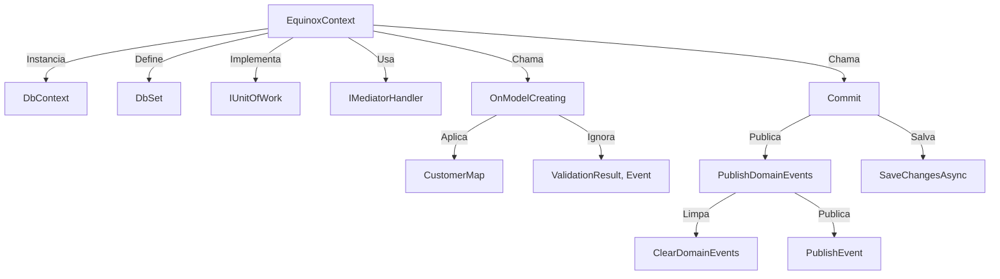
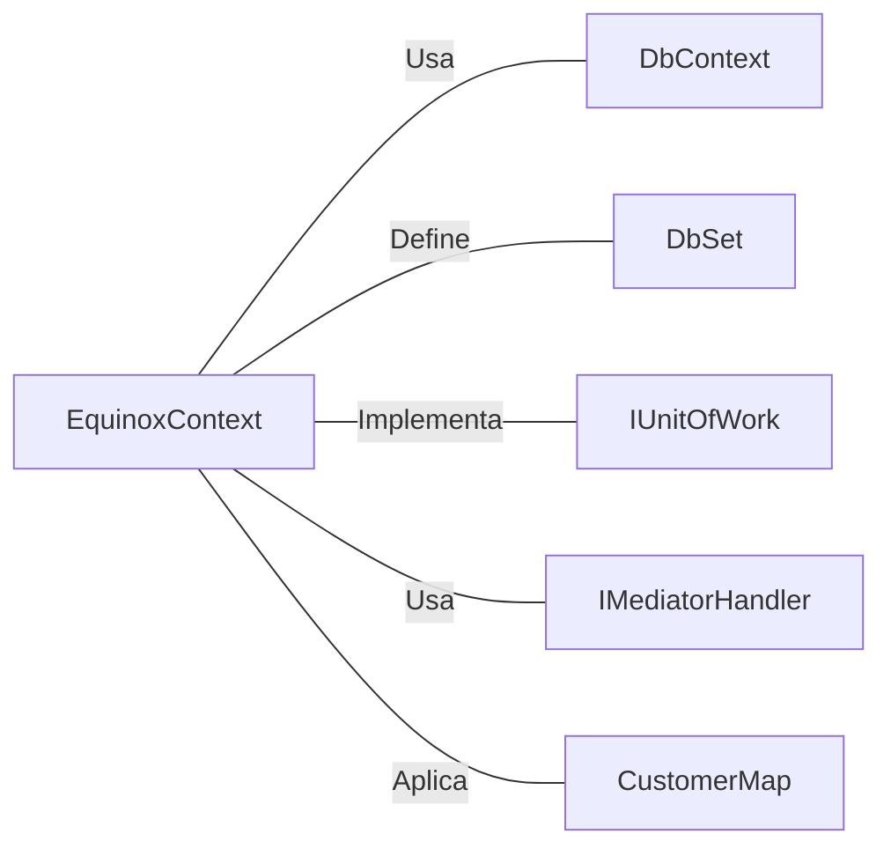

# EquinoxContext.cs: Contexto de Banco de Dados para o Domínio Equinox

## Visão Geral
O arquivo `EquinoxContext.cs` define o contexto do banco de dados para o domínio Equinox. Ele é responsável por configurar o contexto do banco de dados, definir o conjunto de dados para o modelo `Customer` e fornecer um método para confirmar as alterações feitas no banco de dados. Além disso, ele também define uma extensão para o `IMediatorHandler` para publicar eventos de domínio.

## Fluxo do Processo

## Insights
- O contexto do banco de dados `EquinoxContext` é selado, o que significa que ele não pode ser herdado.
- O `EquinoxContext` implementa a interface `IUnitOfWork`, que é uma abstração para o padrão Unit of Work.
- O `EquinoxContext` usa o `IMediatorHandler` para publicar eventos de domínio.
- O `EquinoxContext` define um `DbSet` para o modelo `Customer`.
- O método `OnModelCreating` é usado para configurar o modelo do banco de dados. Ele aplica a configuração `CustomerMap` e define o tipo de coluna para todas as propriedades de string como `varchar(100)`.
- O método `Commit` é usado para confirmar as alterações feitas no banco de dados. Ele publica eventos de domínio antes de salvar as alterações.
- A extensão `PublishDomainEvents` para o `IMediatorHandler` é usada para publicar eventos de domínio. Ela limpa os eventos de domínio das entidades depois de publicá-los.

## Dependências (Opcional)

- `DbContext`: O `EquinoxContext` estende o `DbContext` do Entity Framework Core.
- `DbSet<Customer>`: O `EquinoxContext` define um `DbSet` para o modelo `Customer`.
- `IUnitOfWork`: O `EquinoxContext` implementa a interface `IUnitOfWork`.
- `IMediatorHandler`: O `EquinoxContext` usa o `IMediatorHandler` para publicar eventos de domínio.
- `CustomerMap`: O `EquinoxContext` aplica a configuração `CustomerMap` no método `OnModelCreating`.

## Vulnerabilidades
- O método `Commit` publica eventos de domínio antes de salvar as alterações. Isso pode levar a inconsistências se a operação de salvar falhar, pois os eventos de domínio já teriam sido publicados.
- O método `OnModelCreating` define o tipo de coluna para todas as propriedades de string como `varchar(100)`. Isso pode não ser adequado para todas as propriedades de string, pois algumas podem exigir um comprimento maior.