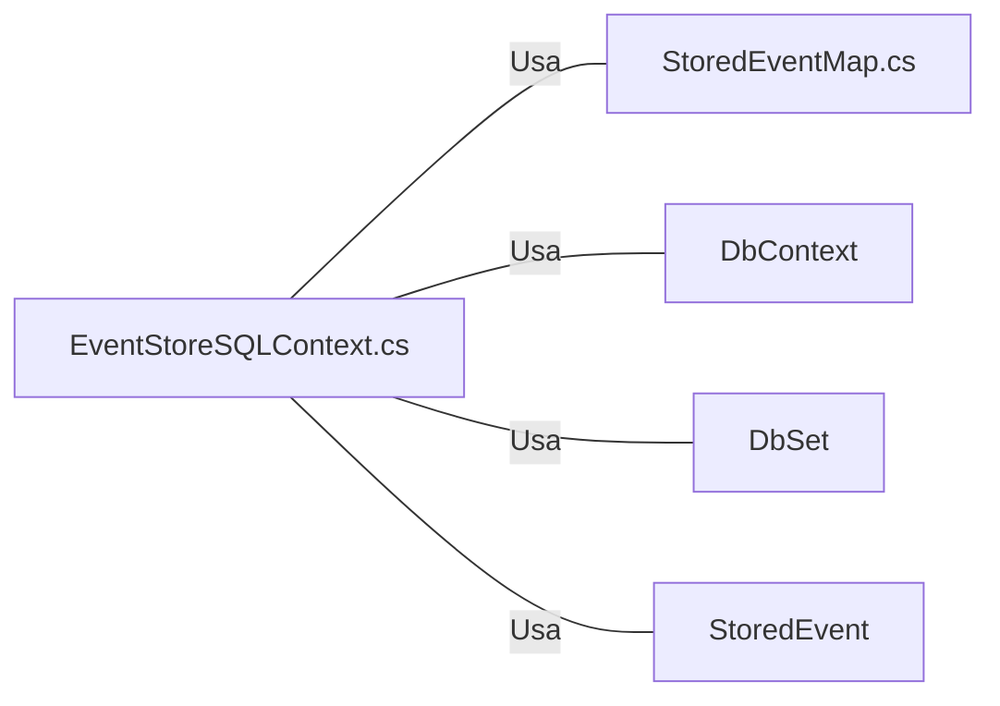

# EventStoreSQLContext.cs: Contexto de Armazenamento de Eventos SQL

## Visão Geral
Este arquivo define o contexto de armazenamento de eventos SQL, que é uma classe que herda de `DbContext` do Entity Framework. Ele é responsável por configurar o mapeamento de entidades e estabelecer a conexão com o banco de dados.

## Fluxo do Processo
```mermaid
classDiagram
    EventStoreSqlContext --|> DbContext : Herda
    EventStoreSqlContext : +EventStoreSqlContext(DbContextOptions<EventStoreSqlContext> options)
    EventStoreSqlContext : +DbSet<StoredEvent> StoredEvent
    EventStoreSqlContext : +void OnModelCreating(ModelBuilder modelBuilder)
    StoredEventMap --|> IEntityTypeConfiguration<StoredEvent> : Implementa
    EventStoreSqlContext : -StoredEventMap storedEventMap
    EventStoreSqlContext --|> StoredEventMap : Usa
```

## Insights
- A classe `EventStoreSqlContext` herda de `DbContext`, que é uma classe central do Entity Framework.
- A propriedade `StoredEvent` é do tipo `DbSet<StoredEvent>`, que representa uma coleção de todos os eventos armazenados que são recuperados do banco de dados.
- O método `OnModelCreating` é sobrescrito para aplicar configurações personalizadas ao modelo de dados. Neste caso, a configuração `StoredEventMap` é aplicada ao modelo.

## Dependências (Opcional)

- `StoredEventMap.cs` : É uma classe que implementa a interface `IEntityTypeConfiguration<StoredEvent>`. É usada para configurar o mapeamento da entidade `StoredEvent` no banco de dados.
- `DbContext` : É uma classe do Entity Framework que serve como uma sessão com o banco de dados e permite consultar e salvar instâncias de entidades.
- `DbSet` : Representa uma coleção de entidades que podem ser consultadas a partir do banco de dados.
- `StoredEvent` : É uma entidade que representa um evento armazenado no banco de dados.

## Vulnerabilidades
Não foram identificadas vulnerabilidades no código.