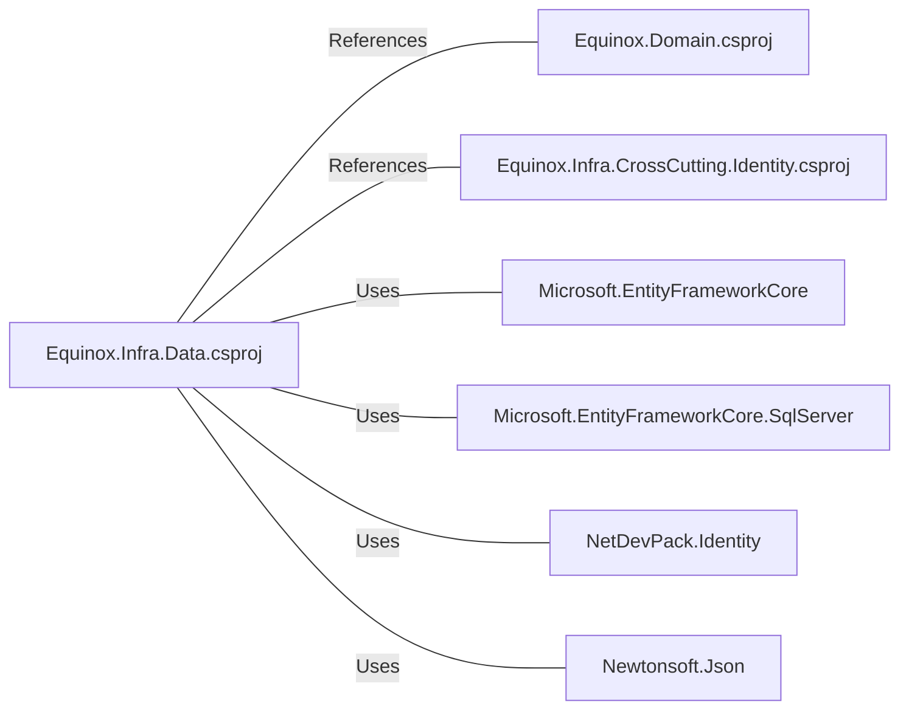

# Equinox.Infra.Data.csproj: Projeto de Infraestrutura de Dados Equinox

## Visão Geral
Este é um projeto de infraestrutura de dados do Equinox, que define as dependências do projeto e as versões dos pacotes utilizados. Ele é responsável por definir as referências de projeto e pacotes necessários para o funcionamento do projeto.

## Fluxo de Processo
Como este é um arquivo de projeto e não contém lógica de programação, um diagrama de fluxo de processo não é aplicável. No entanto, as dependências do projeto são claramente definidas no arquivo.

## Insights
- O projeto está usando o .NET 6.0 como framework de destino.
- Existem referências de projeto para `Equinox.Domain.csproj` e `Equinox.Infra.CrossCutting.Identity.csproj`.
- O projeto depende de vários pacotes, incluindo `Microsoft.EntityFrameworkCore`, `Microsoft.EntityFrameworkCore.SqlServer`, `NetDevPack.Identity` e `Newtonsoft.Json`.

## Dependências
O projeto tem várias dependências externas, incluindo pacotes NuGet e outros projetos dentro da mesma solução.

- `Equinox.Domain.csproj`: Este projeto é referenciado pelo projeto atual. Ele provavelmente contém as classes de domínio que são usadas neste projeto.
- `Equinox.Infra.CrossCutting.Identity.csproj`: Este projeto também é referenciado pelo projeto atual. Ele provavelmente contém a lógica relacionada à identidade do usuário.
- `Microsoft.EntityFrameworkCore`: Este pacote é usado para o acesso a dados usando o Entity Framework Core.
- `Microsoft.EntityFrameworkCore.SqlServer`: Este pacote é usado para o acesso a dados SQL Server usando o Entity Framework Core.
- `NetDevPack.Identity`: Este pacote é usado para a gestão de identidade do usuário.
- `Newtonsoft.Json`: Este pacote é usado para a serialização e desserialização de objetos JSON.

## Vulnerabilidades
Não foram identificadas vulnerabilidades específicas no código. No entanto, é importante garantir que as versões mais recentes dos pacotes sejam usadas para evitar possíveis vulnerabilidades de segurança conhecidas. Além disso, as referências de projeto devem ser mantidas atualizadas para garantir a compatibilidade.