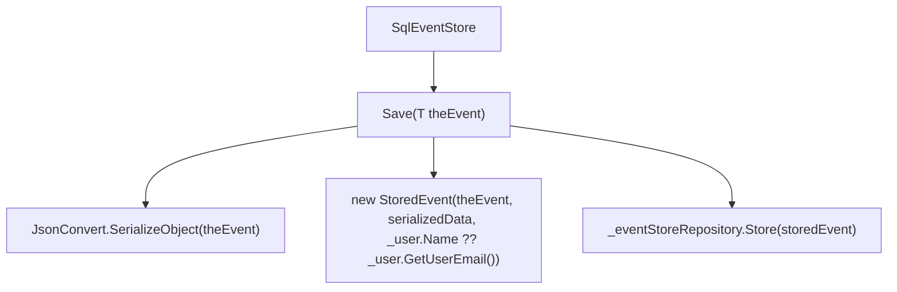
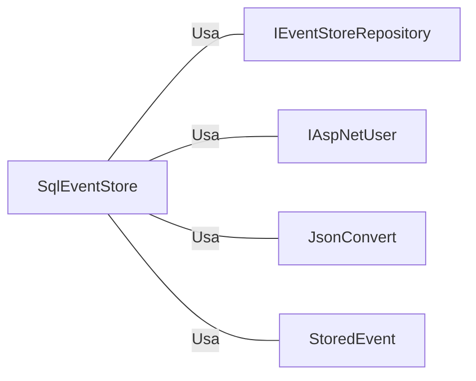

# SqlEventStore.cs: Armazenamento de Eventos SQL

## Visão Geral
O código é responsável por armazenar eventos em um repositório de eventos SQL. Ele usa a biblioteca Newtonsoft.Json para serializar os eventos antes de armazená-los. O código também faz uso de um usuário AspNet para rastrear quem está armazenando os eventos.

## Fluxo do Processo

## Insights
- O código usa a biblioteca Newtonsoft.Json para serializar os eventos antes de armazená-los. Isso é feito porque a biblioteca System.Text.Json não suporta a serialização de objetos com propriedades herdadas.
- O código faz uso de um usuário AspNet para rastrear quem está armazenando os eventos.
- O código armazena os eventos serializados em um repositório de eventos SQL.

## Dependências (Opcional)
O código tem as seguintes dependências externas:

- `IEventStoreRepository` : Repositório de eventos SQL onde os eventos são armazenados.
- `IAspNetUser` : Usuário AspNet usado para rastrear quem está armazenando os eventos.
- `JsonConvert` : Biblioteca Newtonsoft.Json usada para serializar os eventos.
- `StoredEvent` : Classe que representa um evento armazenado.

## Vulnerabilidades
- O código não verifica se o objeto de evento passado para o método `Save<T>` é nulo antes de tentar serializá-lo. Isso pode levar a uma exceção `NullReferenceException`.
- O código assume que o usuário AspNet sempre terá um nome ou um e-mail. Se ambos forem nulos, isso pode levar a uma exceção `NullReferenceException`.
- O código não verifica se o repositório de eventos SQL está disponível e funcionando corretamente antes de tentar armazenar um evento. Isso pode levar a uma exceção se o repositório não estiver disponível.