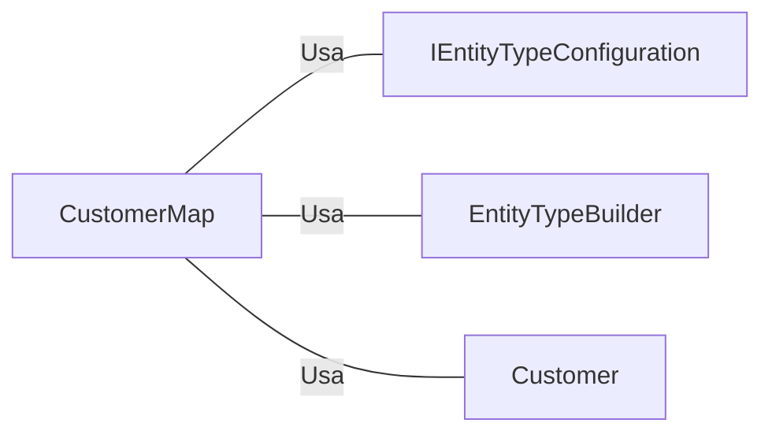

# CustomerMap.cs: Mapeamento de Cliente

## Visão Geral
Este arquivo define o mapeamento da estrutura de dados do cliente para o banco de dados usando o Entity Framework. Ele especifica os tipos de dados, comprimentos máximos e restrições de colunas para a tabela de clientes.

## Fluxo do Processo
Como este arquivo é uma estrutura de dados e não contém lógica de programação, um diagrama de classe é mais apropriado para representar suas informações.

```mermaid
classDiagram
    CustomerMap : -Id : int
    CustomerMap : -Name : varchar(100)
    CustomerMap : -Email : varchar(100)
```

## Insights
- A classe `CustomerMap` implementa a interface `IEntityTypeConfiguration<Customer>`, que é usada para configurar a entidade do cliente no contexto do Entity Framework.
- A propriedade `Id` é mapeada para a coluna "Id" no banco de dados.
- A propriedade `Name` é mapeada para uma coluna de tipo varchar de comprimento máximo 100 e é obrigatória.
- A propriedade `Email` é mapeada para uma coluna de tipo varchar de comprimento máximo 100 e é obrigatória.

## Dependências (Opcional)
Este arquivo depende das seguintes classes externas:



- `IEntityTypeConfiguration<Customer>` : Interface usada para configurar a entidade do cliente no contexto do Entity Framework.
- `EntityTypeBuilder<Customer>` : Classe usada para construir e mapear a entidade do cliente.
- `Customer` : Classe de modelo que representa a entidade do cliente.

## Vulnerabilidades
Não foram identificadas vulnerabilidades específicas neste código. No entanto, é importante garantir que os dados inseridos nas propriedades `Name` e `Email` sejam validados para evitar a injeção de SQL e garantir a integridade dos dados.