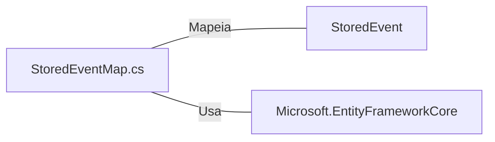

# StoredEventMap.cs: Mapeamento de Eventos Armazenados

## Visão Geral
O arquivo `StoredEventMap.cs` é responsável por configurar o mapeamento da estrutura de dados `StoredEvent` para o banco de dados usando o Entity Framework. Ele define as propriedades da estrutura de dados e como elas são mapeadas para as colunas correspondentes na tabela do banco de dados.

## Fluxo do Processo
Como este arquivo é uma estrutura de dados e não contém lógica de programação, um diagrama de classe ou uma tabela com os atributos relacionados seria mais apropriado para representar seu conteúdo.

| Atributo | Tipo de Dado | Descrição |
|----------|--------------|-----------|
| Timestamp | DateTime | Data e hora da criação do evento. Mapeado para a coluna "CreationDate" no banco de dados. |
| MessageType | string | Tipo da mensagem do evento. Mapeado para a coluna "Action" no banco de dados e tem um tipo de dados definido como "varchar(100)". |

## Insights
- A estrutura de dados `StoredEvent` tem duas propriedades: `Timestamp` e `MessageType`.
- A propriedade `Timestamp` é mapeada para a coluna "CreationDate" no banco de dados.
- A propriedade `MessageType` é mapeada para a coluna "Action" no banco de dados e tem um tipo de dados definido como "varchar(100)".

## Dependências
O arquivo `StoredEventMap.cs` tem dependências do Entity Framework e da estrutura de dados `StoredEvent` do domínio do aplicativo.

- `StoredEvent` : Estrutura de dados do domínio do aplicativo que é mapeada para o banco de dados.
- `Microsoft.EntityFrameworkCore` : Framework usado para mapear a estrutura de dados para o banco de dados.

## Vulnerabilidades
Não foram identificadas vulnerabilidades específicas neste código. No entanto, é importante garantir que os dados sejam validados antes de serem salvos no banco de dados para evitar a injeção de SQL e outros tipos de ataques. Além disso, o uso de "varchar(100)" para o tipo de dados `MessageType` pode limitar a quantidade de informação que pode ser armazenada para essa propriedade.