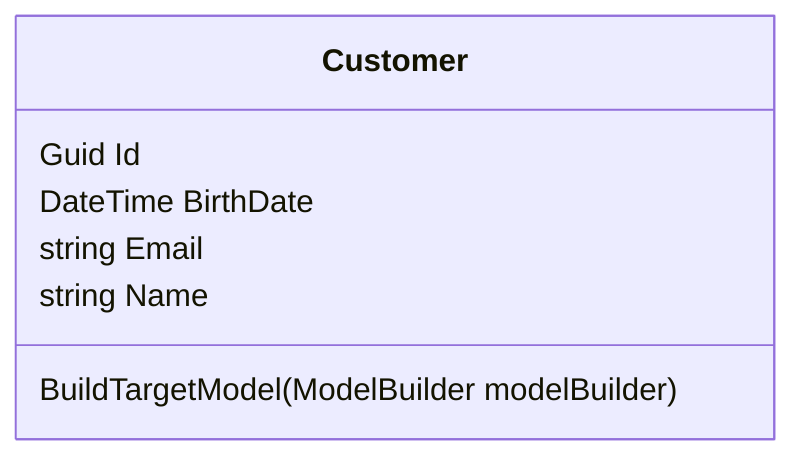
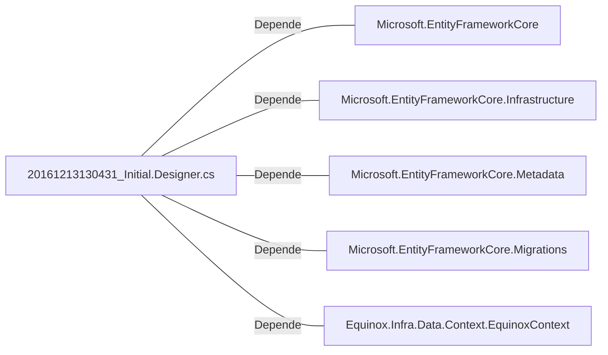

# 20161213130431_Initial.Designer.cs: Migração Inicial do Banco de Dados

## Visão Geral
Este arquivo de migração do Entity Framework Core define a estrutura inicial do banco de dados para a aplicação. Ele especifica a criação de uma tabela chamada "Customers" com quatro colunas: Id, BirthDate, Email e Name.

## Fluxo do Processo

## Insights
- A tabela "Customers" é criada com quatro colunas: Id, BirthDate, Email e Name.
- A coluna "Id" é do tipo Guid e é gerada automaticamente na adição de um novo registro.
- As colunas "Email" e "Name" são do tipo string e são obrigatórias. Além disso, ambas têm um tamanho máximo definido.
- A coluna "BirthDate" é do tipo DateTime.

## Dependências (Opcional)
- Microsoft.EntityFrameworkCore
- Microsoft.EntityFrameworkCore.Infrastructure
- Microsoft.EntityFrameworkCore.Metadata
- Microsoft.EntityFrameworkCore.Migrations
- Equinox.Infra.Data.Context.EquinoxContext

- `Microsoft.EntityFrameworkCore`: Fornece as funcionalidades principais do Entity Framework Core.
- `Microsoft.EntityFrameworkCore.Infrastructure`: Fornece serviços e opções de configuração para o Entity Framework Core.
- `Microsoft.EntityFrameworkCore.Metadata`: Fornece classes e interfaces que fornecem detalhes sobre as entidades e relações do modelo.
- `Microsoft.EntityFrameworkCore.Migrations`: Fornece serviços e atributos para lidar com migrações do banco de dados.
- `Equinox.Infra.Data.Context.EquinoxContext`: Contexto do banco de dados da aplicação.

## Manipulação de Dados (SQL) (Opcional)
- `Customers`: Criação da tabela com as colunas Id, BirthDate, Email e Name. A operação principal é a criação da tabela.