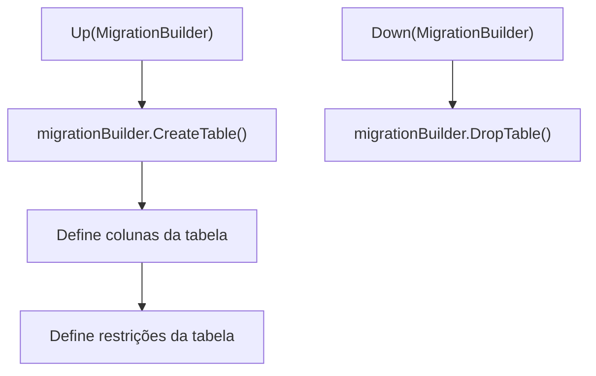

# 20161213130431_Initial.cs: Migração Inicial do Banco de Dados

## Visão Geral
Este arquivo contém a migração inicial do banco de dados para a aplicação. Ele define a criação da tabela "Customers" com suas respectivas colunas e restrições. Além disso, também define a ação a ser tomada caso a migração seja revertida, que é a remoção da tabela "Customers".

## Fluxo do Processo

## Insights
- A tabela "Customers" é criada com as colunas: Id, BirthDate, Email e Name.
- A coluna "Id" é do tipo Guid e não pode ser nula.
- A coluna "BirthDate" é do tipo DateTime e não pode ser nula.
- A coluna "Email" é do tipo string, tem um tamanho máximo de 11 caracteres, não pode ser nula e é do tipo varchar(100).
- A coluna "Name" é do tipo string, tem um tamanho máximo de 100 caracteres, não pode ser nula e é do tipo varchar(100).
- A restrição definida para a tabela é que a coluna "Id" é a chave primária.
- Se a migração for revertida, a tabela "Customers" será removida.

## Dependências (Opcional)
- Microsoft.EntityFrameworkCore.Migrations: Este é o pacote NuGet que fornece as classes e métodos necessários para realizar as migrações do banco de dados.

- `Microsoft.EntityFrameworkCore.Migrations` : Fornece as classes e métodos necessários para realizar as migrações do banco de dados. É usado para criar e remover a tabela "Customers".

## Manipulação de Dados (SQL) (Opcional)
A tabela "Customers" é criada com as seguintes colunas:

| Nome da Coluna | Tipo de Dados | Formato | Notas |
| --- | --- | --- | --- |
| Id | Guid | - | Não pode ser nulo |
| BirthDate | DateTime | - | Não pode ser nulo |
| Email | string | varchar(100) | Não pode ser nulo, tamanho máximo de 11 caracteres |
| Name | string | varchar(100) | Não pode ser nulo, tamanho máximo de 100 caracteres |

A tabela "Customers" é removida se a migração for revertida.