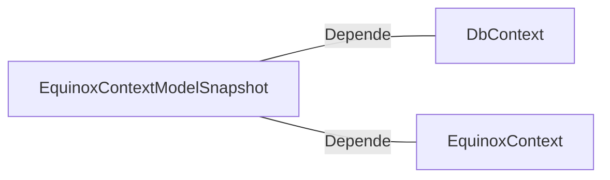

# EquinoxContextModelSnapshot.cs: Snapshot do Modelo de Contexto Equinox

## Visão Geral
Este arquivo define um snapshot do modelo de contexto do Entity Framework para a aplicação Equinox. Ele é usado para criar e manter o esquema do banco de dados de acordo com as entidades definidas no contexto. Neste caso, a entidade definida é "Customer".

## Fluxo do Processo
Como este é um snapshot de um modelo de dados, não há um fluxo de processo específico. No entanto, a estrutura de dados para a entidade "Customer" pode ser representada como uma tabela:

| Atributo | Tipo de Dado | Restrições |
|----------|--------------|------------|
| Id       | Guid         | Valor gerado na adição, nome da coluna "Id" |
| BirthDate| DateTime     | Nenhum |
| Email    | string       | Obrigatório, tipo de coluna "varchar(100)", comprimento máximo 11 |
| Name     | string       | Obrigatório, tipo de coluna "varchar(100)", comprimento máximo 100 |

## Insights
- O snapshot do modelo de contexto é usado para criar e manter o esquema do banco de dados.
- A entidade "Customer" é definida com quatro propriedades: Id, BirthDate, Email e Name.
- As propriedades Email e Name são obrigatórias e têm restrições específicas de tipo e comprimento.
- A propriedade Id é um Guid que é gerado automaticamente quando um novo cliente é adicionado.

## Dependências (Opcional)
Este arquivo depende das seguintes classes externas:
- `DbContext` do Entity Framework
- `EquinoxContext` do namespace Equinox.Infra.Data.Context

Diagrama de dependências:

Lista de dependências identificadas:
- `DbContext`: Classe base para todos os contextos de banco de dados no Entity Framework. É usada para modelar as entidades que compõem o banco de dados.
- `EquinoxContext`: Classe específica do contexto do banco de dados para a aplicação Equinox. É usada para definir as entidades e suas relações.

## Vulnerabilidades
- O campo de e-mail está definido para ter um comprimento máximo de 11 caracteres, o que é muito curto para a maioria dos endereços de e-mail. Isso pode levar a erros de validação de dados.
- Não há nenhuma medida de segurança ou criptografia mencionada para os dados sensíveis do cliente, como e-mail. Isso pode levar a problemas de privacidade e segurança.
- Não há validações adicionais ou restrições mencionadas para os campos de dados, o que pode levar a dados inválidos ou inconsistentes.