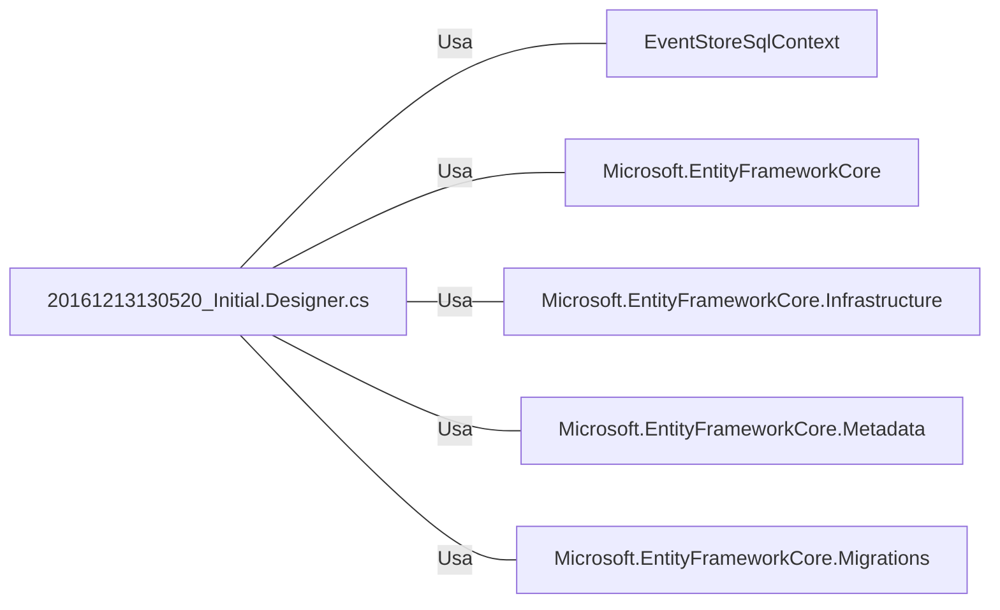

# 20161213130520_Initial.Designer.cs: Migração Inicial do EventStoreSQL

## Visão Geral
Este arquivo contém a migração inicial do banco de dados EventStoreSQL. Ele define a estrutura da tabela `StoredEvent` e suas colunas.

## Fluxo do Processo
Como este é um arquivo de migração de banco de dados, ele não contém um fluxo de processo. No entanto, ele define a estrutura da tabela `StoredEvent` como mostrado abaixo:

| Atributo | Tipo | Descrição |
| --- | --- | --- |
| Id | Guid | Identificador único do evento armazenado. É gerado automaticamente ao adicionar um novo evento. |
| AggregateId | Guid | Identificador único do agregado associado ao evento. |
| Data | string | Dados associados ao evento. |
| MessageType | string | Tipo da mensagem do evento. Armazenado na coluna `Action` e tem um tipo de dados `varchar(100)`. |
| Timestamp | DateTime | Data e hora da criação do evento. Armazenado na coluna `CreationDate`. |
| User | string | Usuário que criou o evento. |

## Insights
- A tabela `StoredEvent` é criada com seis colunas: `Id`, `AggregateId`, `Data`, `MessageType`, `Timestamp` e `User`.
- O `Id` é um Guid que é gerado automaticamente ao adicionar um novo evento.
- O `MessageType` é armazenado na coluna `Action` e tem um tipo de dados `varchar(100)`.
- O `Timestamp` é armazenado na coluna `CreationDate`.

## Dependências (Opcional)
Este arquivo de migração depende das seguintes classes e pacotes externos:

- `EventStoreSqlContext`: Contexto do banco de dados usado para interagir com o banco de dados EventStoreSQL.
- `Microsoft.EntityFrameworkCore`: Pacote principal do Entity Framework Core.
- `Microsoft.EntityFrameworkCore.Infrastructure`: Pacote do Entity Framework Core usado para configurações de infraestrutura.
- `Microsoft.EntityFrameworkCore.Metadata`: Pacote do Entity Framework Core usado para configurações de metadados.
- `Microsoft.EntityFrameworkCore.Migrations`: Pacote do Entity Framework Core usado para configurações de migrações.

## Manipulação de Dados (SQL) (Opcional)
A tabela `StoredEvent` é criada com a seguinte estrutura:

| Nome da Coluna | Tipo de Dados | Descrição |
| --- | --- | --- |
| Id | Guid | Identificador único do evento armazenado. |
| AggregateId | Guid | Identificador único do agregado associado ao evento. |
| Data | string | Dados associados ao evento. |
| MessageType (Action) | varchar(100) | Tipo da mensagem do evento. |
| Timestamp (CreationDate) | DateTime | Data e hora da criação do evento. |
| User | string | Usuário que criou o evento. |

## Vulnerabilidades
Não foram identificadas vulnerabilidades específicas neste código. No entanto, é importante garantir que os dados inseridos na tabela `StoredEvent` sejam validados e sanitizados para evitar ataques de injeção de SQL. Além disso, o acesso à tabela `StoredEvent` deve ser controlado para evitar acesso não autorizado aos dados.