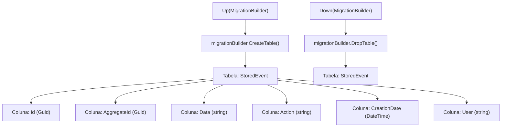

# 20161213130520_Initial.cs: Migração Inicial do EventStoreSQL

## Visão Geral
Este arquivo contém a migração inicial para o banco de dados EventStoreSQL. A migração cria uma tabela chamada "StoredEvent" com várias colunas. Se a migração for revertida, a tabela "StoredEvent" será excluída.

## Fluxo do Processo

## Insights
- A tabela "StoredEvent" é criada com as seguintes colunas: Id, AggregateId, Data, Action, CreationDate e User.
- A coluna "Id" é usada como chave primária da tabela.
- A tabela "StoredEvent" é excluída quando a migração é revertida.

## Dependências (Opcional)
Não foram identificadas dependências externas neste código.

## Manipulação de Dados (SQL) (Opcional)
A tabela "StoredEvent" é criada com a seguinte estrutura:

| Nome da Coluna | Tipo de Dados | Descrição |
| --- | --- | --- |
| Id | Guid | Identificador único da entidade. |
| AggregateId | Guid | Identificador único do agregado. |
| Data | string | Dados associados ao evento. |
| Action | string | Ação realizada. |
| CreationDate | DateTime | Data de criação do evento. |
| User | string | Usuário que realizou a ação. |

## Vulnerabilidades
Não foram identificadas vulnerabilidades específicas neste código. No entanto, é importante garantir que as práticas adequadas de segurança sejam seguidas ao manipular dados sensíveis, como informações do usuário.