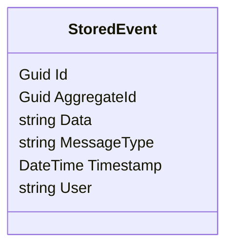
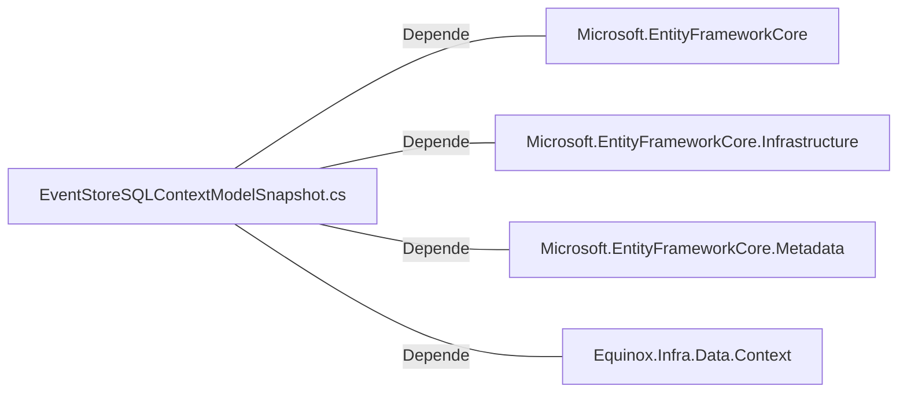

# EventStoreSQLContextModelSnapshot.cs: Snapshot do Modelo de Contexto do EventStoreSQL

## Visão Geral
Este arquivo define um snapshot do modelo de contexto do EventStoreSQL. Ele é usado para criar e manter o modelo de banco de dados do Entity Framework Core para o contexto do EventStoreSQL. O modelo de banco de dados é uma representação do esquema do banco de dados que inclui tabelas, relacionamentos e índices.

## Fluxo do Processo

## Insights
- A classe `StoredEvent` é a única entidade definida neste snapshot do modelo.
- A entidade `StoredEvent` tem os seguintes campos:
  - `Id`: um identificador único para cada evento armazenado.
  - `AggregateId`: um identificador para o agregado ao qual o evento pertence.
  - `Data`: os dados associados ao evento.
  - `MessageType`: o tipo de mensagem do evento.
  - `Timestamp`: a data e hora em que o evento foi criado.
  - `User`: o usuário que criou o evento.
- O campo `MessageType` é mapeado para a coluna `Action` no banco de dados e tem um tipo de dados `varchar(100)`.
- O campo `Timestamp` é mapeado para a coluna `CreationDate` no banco de dados.

## Dependências (Opcional)
- Microsoft.EntityFrameworkCore
- Microsoft.EntityFrameworkCore.Infrastructure
- Microsoft.EntityFrameworkCore.Metadata
- Equinox.Infra.Data.Context

## Manipulação de Dados (SQL) (Opcional)
- `StoredEvent`: Esta entidade é mapeada para a tabela `StoredEvent` no banco de dados. Ela representa um evento que foi armazenado no sistema.

## Vulnerabilidades
- O campo `Data` da entidade `StoredEvent` é do tipo string, o que pode levar a problemas de desempenho se os dados armazenados forem muito grandes.
- Não há validação de dados para os campos da entidade `StoredEvent`, o que pode levar a problemas de integridade dos dados.
- O campo `User` da entidade `StoredEvent` é do tipo string, o que pode levar a problemas de desempenho se os nomes de usuário forem muito longos.