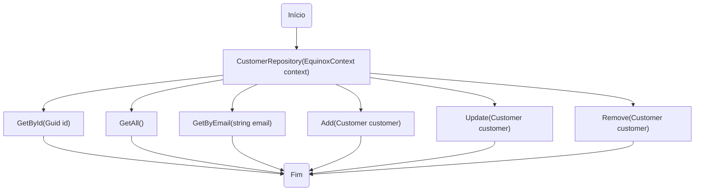
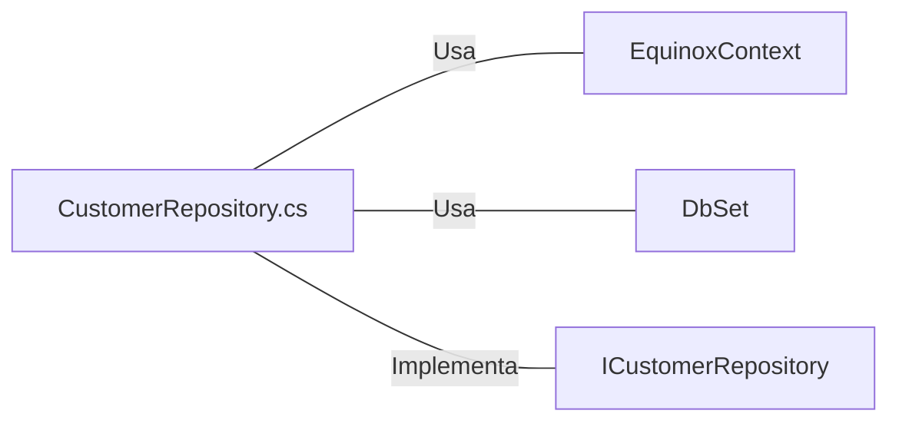

# CustomerRepository.cs: Repositório de Clientes

## Visão Geral
Este código é uma implementação de um repositório para a entidade `Customer` (Cliente). Ele fornece métodos para realizar operações de CRUD (Create, Read, Update, Delete) em um banco de dados usando o Entity Framework.

## Fluxo do Processo

## Insights
- A classe `CustomerRepository` implementa a interface `ICustomerRepository`.
- A classe `CustomerRepository` usa o `EquinoxContext` para interagir com o banco de dados.
- A classe `CustomerRepository` usa o `DbSet<Customer>` para realizar operações de banco de dados na tabela de clientes.
- A classe `CustomerRepository` fornece métodos para obter um cliente por ID, obter todos os clientes, obter um cliente por e-mail, adicionar um cliente, atualizar um cliente e remover um cliente.
- A classe `CustomerRepository` implementa o método `Dispose` para liberar recursos não gerenciados.

## Dependências (Opcional)

- `EquinoxContext` : Contexto do Entity Framework usado para interagir com o banco de dados.
- `DbSet<Customer>` : Representa a coleção de todas as entidades no contexto, ou que podem ser consultadas a partir do banco de dados, de um determinado tipo. `DbSet<Customer>` é usado para realizar operações de banco de dados na tabela de clientes.
- `ICustomerRepository` : Interface que a classe `CustomerRepository` implementa.

## Vulnerabilidades
- O método `GetByEmail` usa `AsNoTracking`. Isso pode levar a problemas se os dados forem modificados e salvos no banco de dados durante a vida útil do contexto.
- Não há validação de dados nos métodos `Add`, `Update` e `Remove`. Isso pode levar a problemas se os dados inválidos forem passados para esses métodos.
- O método `Dispose` é chamado explicitamente, o que pode levar a problemas se o objeto for usado após a chamada `Dispose`.