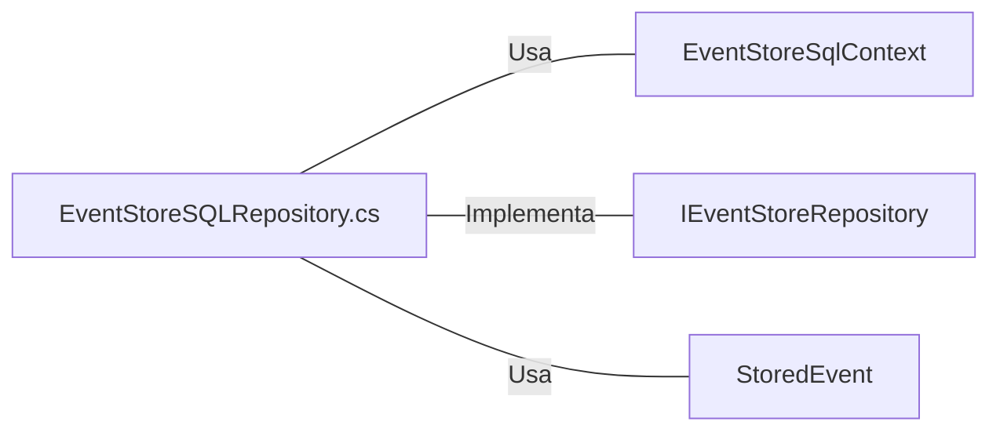

# EventStoreSQLRepository.cs: Repositório de Eventos Armazenados

## Visão Geral
O arquivo `EventStoreSQLRepository.cs` é responsável por implementar o repositório de eventos armazenados. Ele fornece métodos para recuperar todos os eventos associados a um ID de agregado específico e para armazenar um novo evento. Além disso, ele também fornece um método para descartar o contexto do banco de dados quando não é mais necessário.

## Fluxo do Processo
```mermaid
graph TD
    Start("Início") --> A["All(Guid aggregateId)"]
    A --> B["Retorna todos os eventos armazenados associados ao ID do agregado"]
    Start --> C["Store(StoredEvent theEvent)"]
    C --> D["Armazena um novo evento no contexto do banco de dados"]
    Start --> E["Dispose()"]
    E --> End("Fim")["Descarta o contexto do banco de dados"]
```

## Insights
- A classe `EventStoreSqlRepository` implementa a interface `IEventStoreRepository`.
- O método `All(Guid aggregateId)` retorna todos os eventos armazenados associados a um ID de agregado específico.
- O método `Store(StoredEvent theEvent)` armazena um novo evento no contexto do banco de dados.
- O método `Dispose()` descarta o contexto do banco de dados quando não é mais necessário.

## Dependências (Opcional)

- `EventStoreSqlContext` : Contexto do banco de dados usado para operações de banco de dados. É usado para recuperar e armazenar eventos.
- `IEventStoreRepository` : Interface que define os métodos que o `EventStoreSqlRepository` deve implementar.
- `StoredEvent` : Classe que representa um evento armazenado. É usada como parâmetro para o método `Store` e é o tipo de retorno do método `All`.

## Vulnerabilidades
- O método `Store(StoredEvent theEvent)` não implementa nenhuma verificação de erro ou exceção. Se ocorrer um erro durante a operação de armazenamento, o programa pode falhar.
- O método `Dispose()` descarta o contexto do banco de dados, mas não verifica se o contexto já foi descartado. Isso pode levar a uma exceção se o método for chamado mais de uma vez.
- O método `All(Guid aggregateId)` não implementa nenhuma verificação de erro ou exceção. Se ocorrer um erro durante a operação de recuperação, o programa pode falhar.