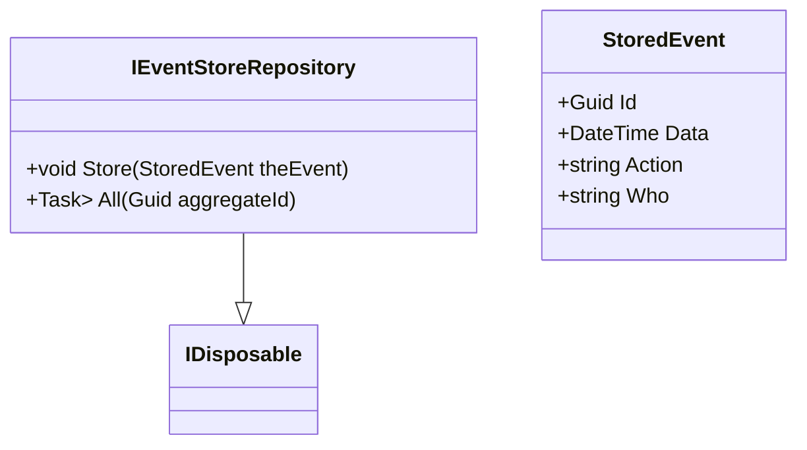

# IEventStoreRepository.cs: Interface do Repositório de Armazenamento de Eventos

## Visão Geral
A interface `IEventStoreRepository` define os métodos para armazenar e recuperar eventos de um repositório de eventos. Ela é parte do namespace `Equinox.Infra.Data.Repository.EventSourcing` e estende a interface `IDisposable`.

## Fluxo do Processo

## Insights
- A interface `IEventStoreRepository` define dois métodos:
  - `Store(StoredEvent theEvent)`: Este método aceita um objeto `StoredEvent` como parâmetro e não retorna nada. Ele é usado para armazenar um evento no repositório.
  - `All(Guid aggregateId)`: Este método aceita um `Guid` como parâmetro e retorna uma lista de eventos armazenados. Ele é usado para recuperar todos os eventos associados a um determinado ID de agregação.
- A interface `IEventStoreRepository` estende a interface `IDisposable`, o que implica que qualquer classe que implemente `IEventStoreRepository` deve também implementar o método `Dispose()` para liberar recursos não gerenciados.

## Dependências (Opcional)
- `StoredEvent`: Esta é uma classe que representa um evento armazenado. Ela tem quatro propriedades: `Id`, `Data`, `Action` e `Who`.

- `StoredEvent`: Representa um evento armazenado. É usado pelo método `Store(StoredEvent theEvent)` para armazenar um evento e pelo método `All(Guid aggregateId)` para retornar uma lista de eventos armazenados.

## Vulnerabilidades
- A interface `IEventStoreRepository` estende `IDisposable`, o que significa que qualquer classe que implemente `IEventStoreRepository` deve implementar o método `Dispose()`. Se o método `Dispose()` não for implementado corretamente, pode haver vazamento de recursos não gerenciados, o que pode levar a problemas de desempenho.
- O método `All(Guid aggregateId)` retorna uma lista de eventos armazenados. Se a lista de eventos for grande, isso pode levar a problemas de desempenho. Além disso, se a lista de eventos contiver dados sensíveis, isso pode levar a problemas de segurança se a lista for exposta a usuários não autorizados.