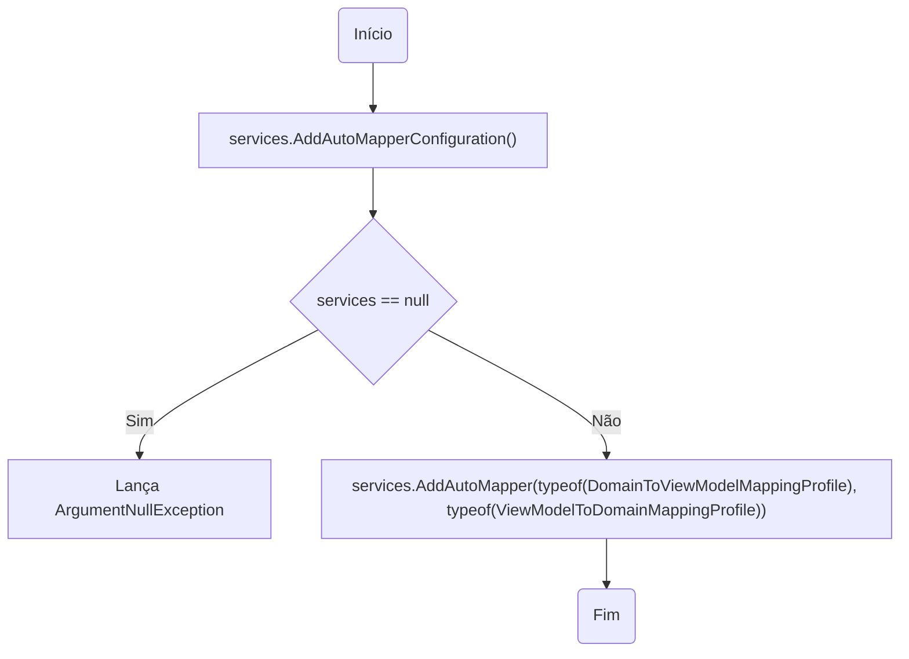
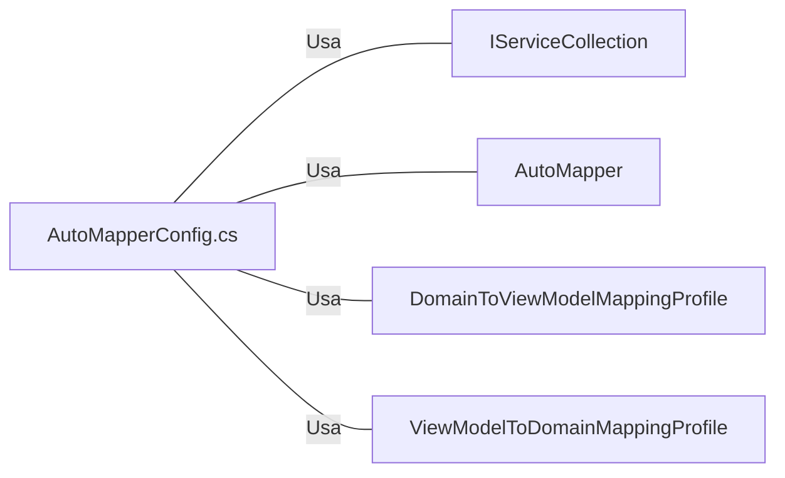

# AutoMapperConfig.cs: Configuração do AutoMapper

## Visão Geral
Este arquivo contém a configuração do AutoMapper para a aplicação. O AutoMapper é uma biblioteca que ajuda a mapear objetos de um tipo para outro. Neste caso, ele está sendo configurado para mapear entre os objetos de domínio e os objetos de visualização (ViewModels).

## Fluxo do Processo

## Insights
- A configuração do AutoMapper é adicionada à coleção de serviços do .NET Core através do método de extensão `AddAutoMapperConfiguration()`.
- O método `AddAutoMapperConfiguration()` adiciona a configuração do AutoMapper à coleção de serviços, especificando os perfis de mapeamento a serem usados (`DomainToViewModelMappingProfile` e `ViewModelToDomainMappingProfile`).
- Se o parâmetro `services` for nulo, uma exceção `ArgumentNullException` será lançada.

## Dependências (Opcional)
O arquivo `AutoMapperConfig.cs` tem dependências em relação a outras classes e bibliotecas. 

- `IServiceCollection`: Interface do .NET Core usada para configurar os serviços da aplicação. É usada para adicionar a configuração do AutoMapper à coleção de serviços.
- `AutoMapper`: Biblioteca usada para mapear objetos de um tipo para outro. É usada para adicionar a configuração do AutoMapper à coleção de serviços.
- `DomainToViewModelMappingProfile`: Classe que define o mapeamento de objetos de domínio para objetos de visualização (ViewModels).
- `ViewModelToDomainMappingProfile`: Classe que define o mapeamento de objetos de visualização (ViewModels) para objetos de domínio.

## Vulnerabilidades
- O código não verifica se as classes de perfil de mapeamento (`DomainToViewModelMappingProfile` e `ViewModelToDomainMappingProfile`) são nulas antes de adicioná-las à configuração do AutoMapper. Isso pode levar a erros em tempo de execução se uma dessas classes for nula.
- O código lança uma exceção `ArgumentNullException` se o parâmetro `services` for nulo. Embora isso seja uma boa prática para verificar a nulidade dos parâmetros, pode interromper o fluxo do programa se não for tratado corretamente.