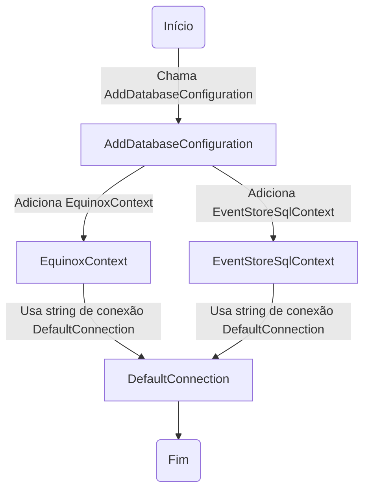
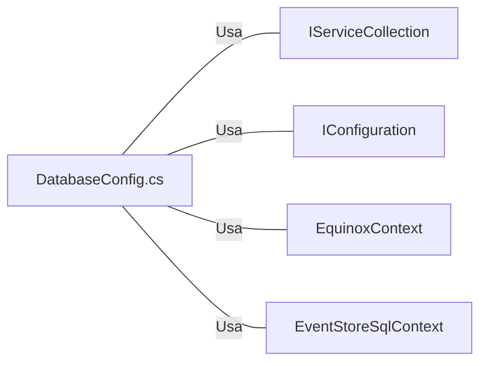

# DatabaseConfig.cs: Configuração do Banco de Dados

## Visão Geral
Este arquivo contém a configuração do banco de dados para a aplicação. Ele define a conexão com o banco de dados para dois contextos diferentes: `EquinoxContext` e `EventStoreSqlContext`. Ambos os contextos usam a mesma string de conexão, chamada "DefaultConnection", que é obtida a partir do objeto de configuração.

## Fluxo do Processo

## Insights
- O método `AddDatabaseConfiguration` é uma extensão do `IServiceCollection`, permitindo que seja chamado diretamente em um objeto `IServiceCollection`.
- O método `AddDatabaseConfiguration` adiciona dois contextos de banco de dados ao `IServiceCollection`: `EquinoxContext` e `EventStoreSqlContext`.
- Ambos os contextos de banco de dados usam a mesma string de conexão, "DefaultConnection", que é obtida do objeto de configuração.
- Se o `IServiceCollection` passado para `AddDatabaseConfiguration` for nulo, uma exceção `ArgumentNullException` será lançada.

## Dependências (Opcional)

- `IServiceCollection`: Usado para adicionar os contextos de banco de dados. É um parâmetro para o método `AddDatabaseConfiguration`.
- `IConfiguration`: Usado para obter a string de conexão "DefaultConnection". É um parâmetro para o método `AddDatabaseConfiguration`.
- `EquinoxContext`: Um dos contextos de banco de dados adicionados ao `IServiceCollection`.
- `EventStoreSqlContext`: Um dos contextos de banco de dados adicionados ao `IServiceCollection`.

## Vulnerabilidades
- A string de conexão "DefaultConnection" é usada para ambos os contextos de banco de dados. Se essa string de conexão for comprometida, ambos os contextos de banco de dados serão afetados.
- Se o `IServiceCollection` passado para `AddDatabaseConfiguration` for nulo, uma exceção `ArgumentNullException` será lançada. Isso pode interromper a execução do programa.