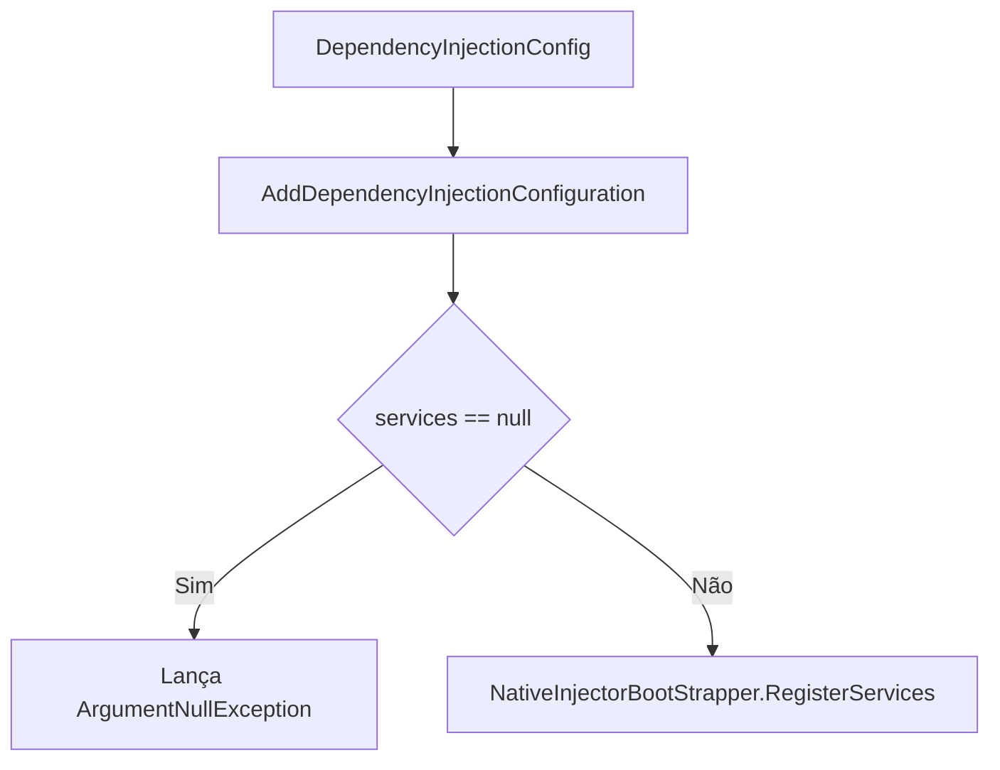

# DependencyInjectionConfig.cs: Configuração de Injeção de Dependência

## Visão Geral
Este arquivo contém a configuração de injeção de dependência para o projeto. Ele registra os serviços necessários para o projeto usando o `NativeInjectorBootStrapper`.

## Fluxo do Processo

Este diagrama mostra o fluxo do método `AddDependencyInjectionConfiguration`. Se o parâmetro `services` for nulo, uma exceção `ArgumentNullException` será lançada. Caso contrário, o método `RegisterServices` do `NativeInjectorBootStrapper` será chamado.

## Insights
- O método `AddDependencyInjectionConfiguration` é uma extensão do `IServiceCollection`, permitindo que seja chamado diretamente em uma instância de `IServiceCollection`.
- O método `RegisterServices` do `NativeInjectorBootStrapper` é usado para registrar os serviços necessários.
- Se o parâmetro `services` for nulo, uma exceção `ArgumentNullException` será lançada.

## Dependências (Opcional)
Este código tem uma dependência externa:

- `NativeInjectorBootStrapper`: Este é usado para registrar os serviços necessários. Ele é chamado dentro do método `AddDependencyInjectionConfiguration`.

## Vulnerabilidades
- O código não verifica se o `NativeInjectorBootStrapper` está disponível ou se o método `RegisterServices` é válido antes de chamá-lo. Isso pode levar a exceções em tempo de execução se o `NativeInjectorBootStrapper` não estiver configurado corretamente.
- O código lança uma exceção `ArgumentNullException` se o `services` for nulo. Isso pode interromper a execução do programa se o `services` não for fornecido corretamente.