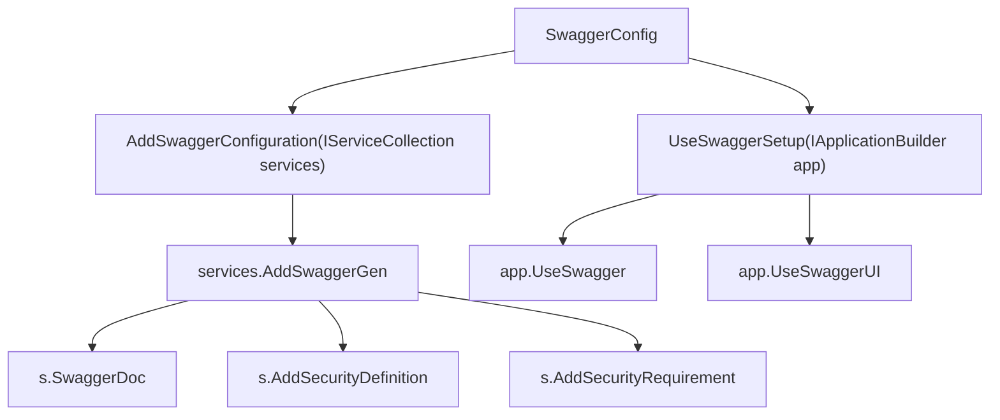
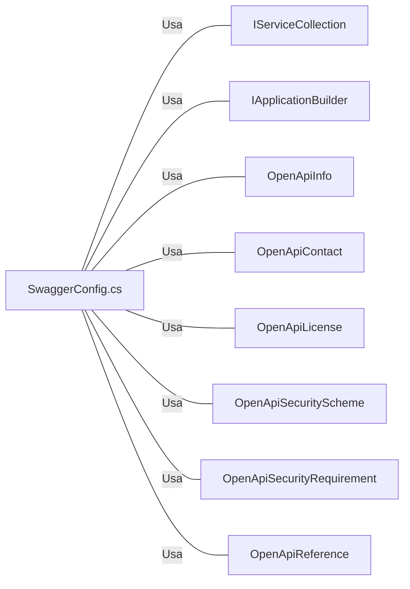

# SwaggerConfig.cs: Configuração do Swagger para a API Equinox

## Visão Geral
Este arquivo contém a configuração do Swagger para a API do projeto Equinox. Ele define como o Swagger é adicionado e usado no aplicativo, incluindo a definição de segurança e a configuração do Swagger UI.

## Fluxo do Processo

## Insights
- A classe `SwaggerConfig` é uma classe estática que contém dois métodos de extensão para configurar e usar o Swagger.
- O método `AddSwaggerConfiguration` adiciona a configuração do Swagger ao serviço fornecido. Ele define a documentação do Swagger, a definição de segurança e a exigência de segurança.
- O método `UseSwaggerSetup` configura o aplicativo para usar o Swagger e o Swagger UI.
- A autenticação JWT é usada, conforme indicado pela definição de segurança "Bearer".

## Dependências (Opcional)

- `IServiceCollection`: Usado para adicionar a configuração do Swagger ao serviço.
- `IApplicationBuilder`: Usado para configurar o aplicativo para usar o Swagger e o Swagger UI.
- `OpenApiInfo`: Usado para definir as informações da API para a documentação do Swagger.
- `OpenApiContact`: Usado para definir as informações de contato para a documentação do Swagger.
- `OpenApiLicense`: Usado para definir as informações de licença para a documentação do Swagger.
- `OpenApiSecurityScheme`: Usado para definir a definição de segurança para a documentação do Swagger.
- `OpenApiSecurityRequirement`: Usado para definir a exigência de segurança para a documentação do Swagger.
- `OpenApiReference`: Usado para referenciar a definição de segurança na exigência de segurança.

## Vulnerabilidades
- O token JWT é passado como um cabeçalho de autorização. Se o token for interceptado, ele pode ser usado para ganhar acesso não autorizado à API.
- A configuração do Swagger está exposta, o que pode revelar detalhes sobre a API que poderiam ser usados para explorar vulnerabilidades.