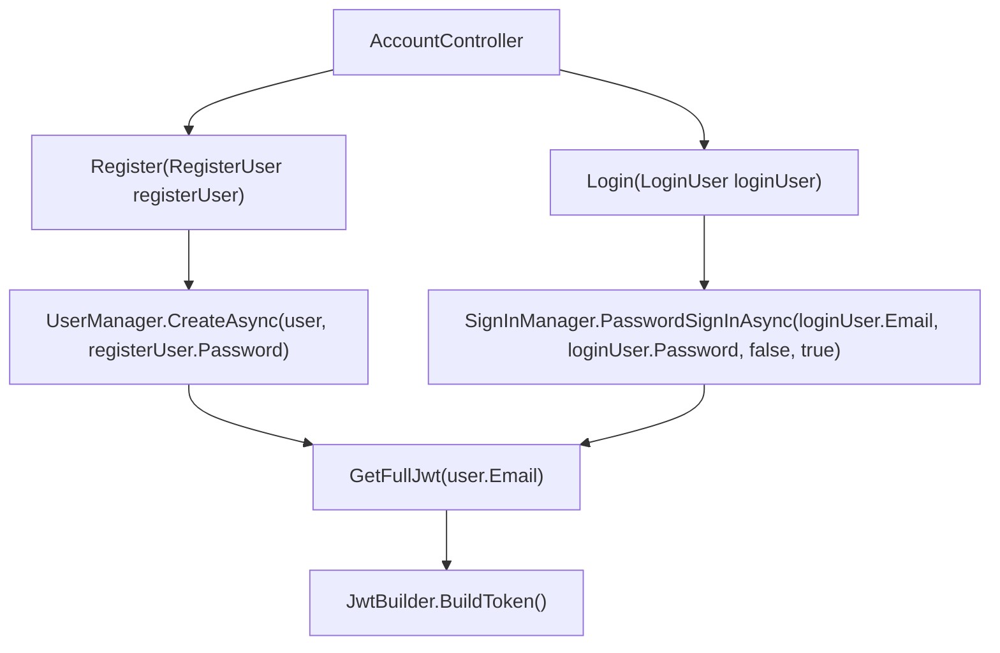
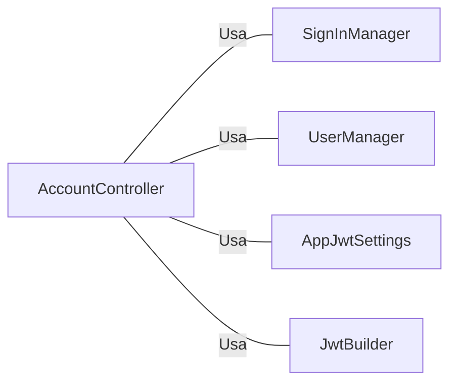

# AccountController.cs: Controlador de Conta de Usuário

## Visão Geral
Este código é responsável por gerenciar as operações de conta de usuário em uma aplicação ASP.NET Core. Ele fornece funcionalidades para registrar um novo usuário e fazer login de um usuário existente. Além disso, ele gera um token JWT completo para o usuário após o registro ou login bem-sucedido.

## Fluxo do Processo

## Insights
- O controlador `AccountController` usa `SignInManager`, `UserManager` e `AppJwtSettings` para gerenciar operações de conta de usuário.
- O método `Register` é usado para registrar um novo usuário. Ele valida o modelo de entrada, cria um novo usuário usando `UserManager` e retorna um token JWT completo se o registro for bem-sucedido.
- O método `Login` é usado para fazer login de um usuário existente. Ele valida o modelo de entrada, tenta fazer login do usuário usando `SignInManager` e retorna um token JWT completo se o login for bem-sucedido.
- O método `GetFullJwt` é usado para gerar um token JWT completo para o usuário. Ele usa `JwtBuilder` para construir o token com as reivindicações e funções do usuário.

## Dependências (Opcional)

- `SignInManager` : Usado para fazer login do usuário. Ele é chamado no método `Login`.
- `UserManager` : Usado para criar um novo usuário. Ele é chamado no método `Register`.
- `AppJwtSettings` : Usado para configurar as configurações do token JWT. Ele é usado no método `GetFullJwt`.
- `JwtBuilder` : Usado para construir o token JWT. Ele é usado no método `GetFullJwt`.

## Vulnerabilidades
- O código não implementa nenhuma forma de limitação de taxa ou proteção contra força bruta no login, o que pode permitir ataques de força bruta na autenticação do usuário.
- O código não implementa nenhuma forma de verificação de complexidade de senha no registro, o que pode permitir que os usuários criem senhas fracas e facilmente adivinháveis.
- O código não implementa nenhuma forma de verificação de e-mail no registro, o que pode permitir que os usuários registrem contas com endereços de e-mail inválidos ou não pertencentes a eles.